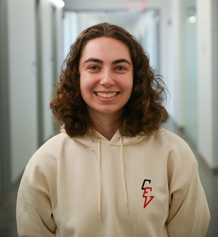

# Rachel Arena ECE 4160 Labs

## About me
Hello! I'm a junior ECE student pursuing a minor in robotics. My academic interests span many fields, but I'm particularly interested in the intersection of hardware and software. I'm very excited for this class! You can reach me at [rga47@cornell.edu](mailto:rga47@cornell.edu).  

## Lab Reports: 

- [Lab 1](lab1.md)