# Lab 1a (Artemis Board)

## Prelab 1a

For this prelab I opened the Arduino IDE for the first time in 3 years, updated it, and installed the Sparkfun Apollo3 boards manager. 

## Tasks 1a

### Task 1: Connection

I plugged the Artemis board into my computer and selected the correct Board and Port settings in the Arduino IDE.

### Task 2: Blink
[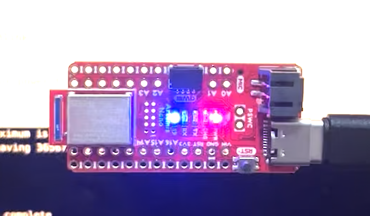](files/Blink.mov)

I ran the example code file Blink, which blinks the on-board LED. The LED is connected to GPIO pin 19 on the Artemis. 

### Task 3: Serial

[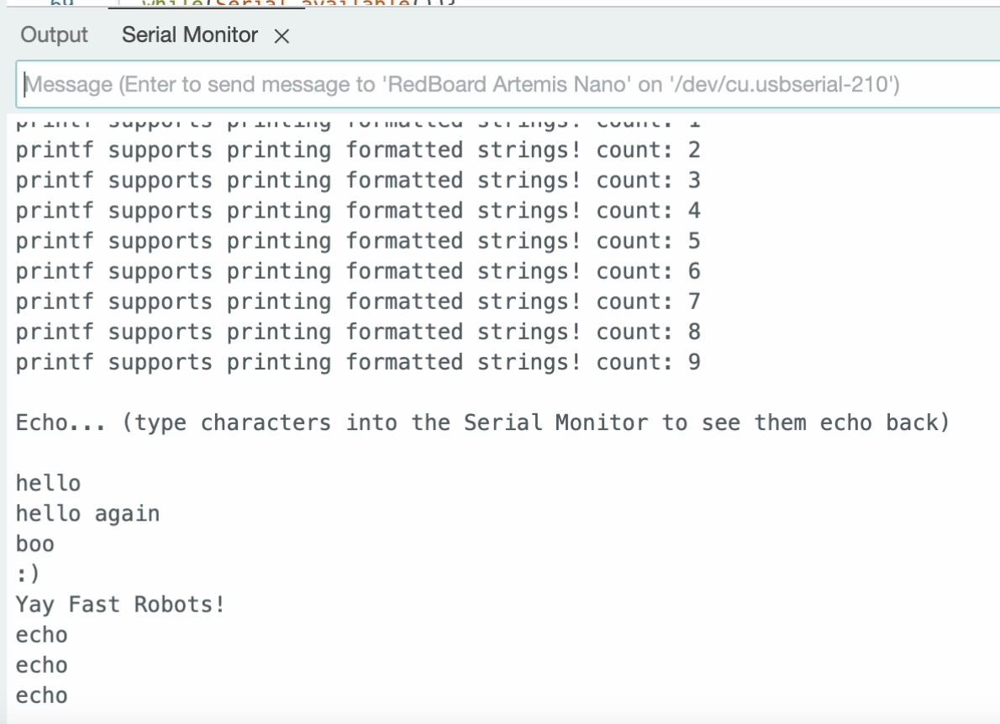](files/Serial.mov)

I ran the example code file Serial, which has the Artemis print any text it is sent onto the serial monitor. Whatever characters I type into the input on the serial monitor are printed to the output of the serial monitor.

### Task 4: Analog Read

[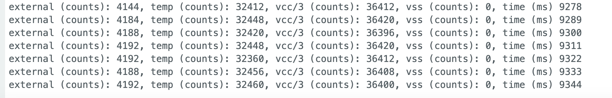](files/AnalogRead.mov)

I ran the example code file analogRead, which tests the temperature sensor. I exhaled hot air onto the chip to watch the temperature rise, and then let it cool down. The video is of the chip cooling down.

### Task 5: Microphone Output

[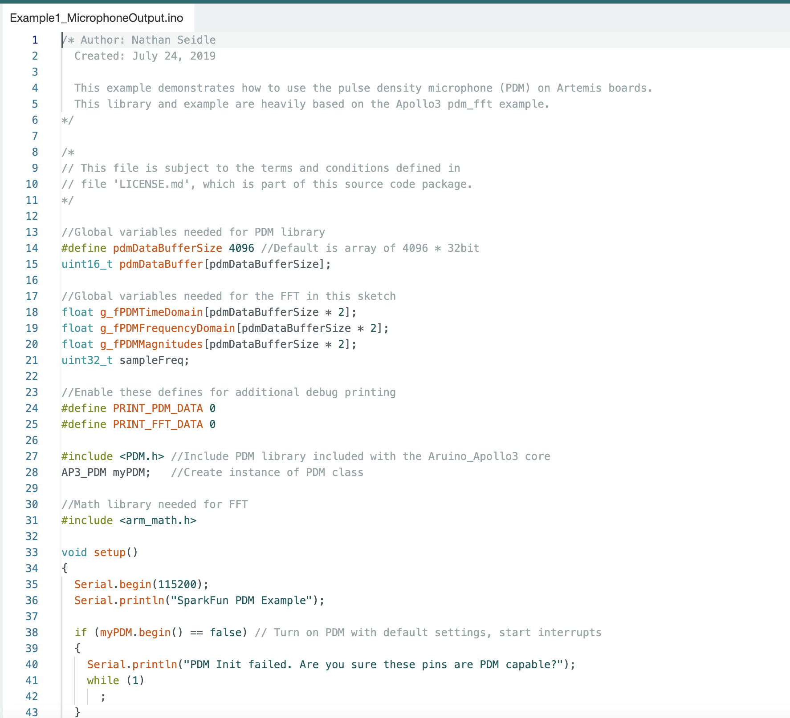](files/MicrophoneOutput.mov)

I ran the example code file PDM, which tests the microphone. By watching the serial monitor I was able to see the change in recorded highest frequency in the ambient noise of the lab as well as when I clapped or spoke next to it. 

# Lab 1b (Bluetooth)

## Prelab 1b
### Setup

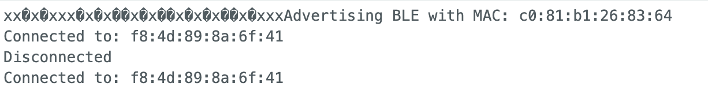

To set up the computer for Lab 1, we followed the instructions to install the necessary dependencies, including the Artemis board support package and the required virtual environment. A serial connection was established with the Artemis board, and the Bluetooth MAC address was retrieved successfully, confirming that communication with the board was functional.

### Codebase

The Artemis board operates as a BLE peripheral, allowing a computer to request and receive data wirelessly. BLE communication is structured into services, which contain characteristics used to exchange data. The Artemis board stores outgoing data in a designated buffer before writing it to a characteristic, making it available for retrieval by the computer. Additionally, notification handlers can be used to automatically inform the computer when new data is available. I analyzed the provided firmware and Python scripts to understand the flow of BLE data exchange.

## Tasks 1b

### Configurations

To ensure proper BLE communication, we made necessary configurations, including:
- Setting up the correct baud rate for serial communication.
- Enabling BLE advertising on the Artemis board.
- Configuring the UUID for Bluetooth.

### Task 1: ECHO

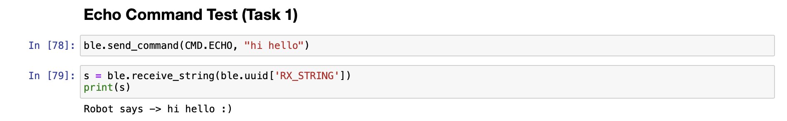

I implemented a simple BLE command that sent a message to the Artemis board, which then echoed it back. Testing in the Jupyter Notebook confirmed successful transmission and reception, as shown in the terminal output.

### Task 2: SEND_THREE_FLOATS

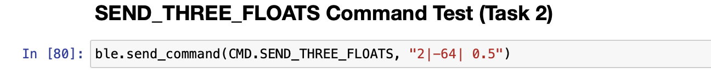
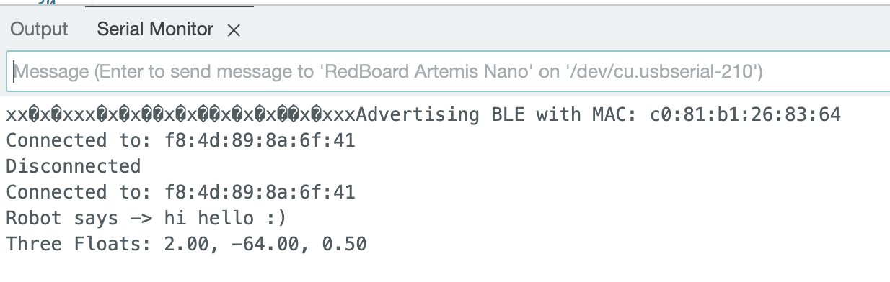

I implemented the SEND_THREE_FLOATS command, enabling the Artemis board to extract and process three float values sent from the computer. The floats were received, stored, and printed successfully on the Artemis serial monitor, confirming correct data transmission and parsing.    

### Task 3: GET_TIME_MILLIS

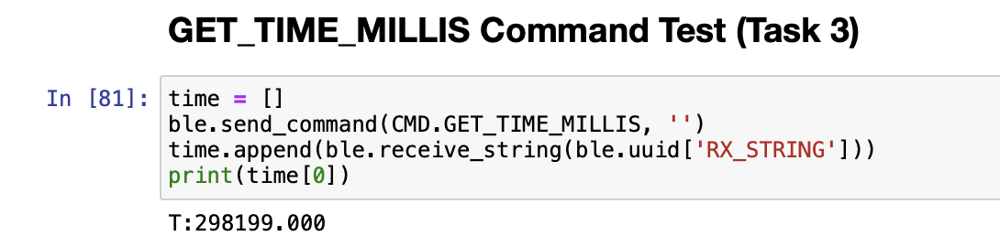

I implemented the GET_TIME_MILLIS command, which requested a timestamp from the Artemis board. When triggered, the board retrieved the current system time in milliseconds and sent it over BLE. The received timestamps were logged in Python, demonstrating successful retrieval with minimal delay.

### Task 4: 

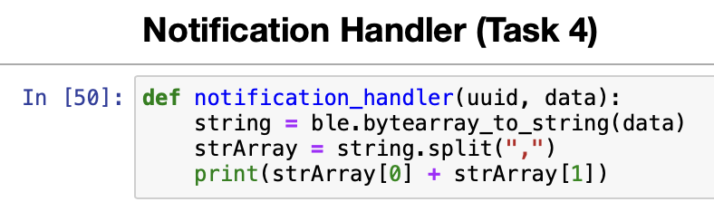

I implemented a notification handler  in Python to listen for updates from the Artemis board. When the string characteristic was updated with a new timestamp, the handler extracted the time value and stored it in a list. This approach allowed the computer to receive timestamped messages asynchronously.

### Task 5: Time_Loop and Data Transfer Rate

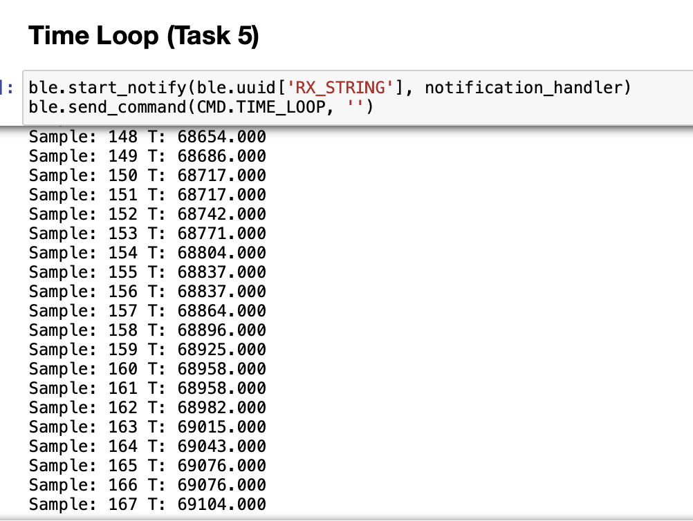

I wrote a loop that continuously transmitted timestamps from the Artemis board to the computer, allowing me to calculate the effective data transfer rate. By collecting timestamps over a few seconds, I calculated the average transmission rate to be 130 transactions over 3 seconds or about 43 transactions/sec.

### Task 6: SEND_TIME_DATA

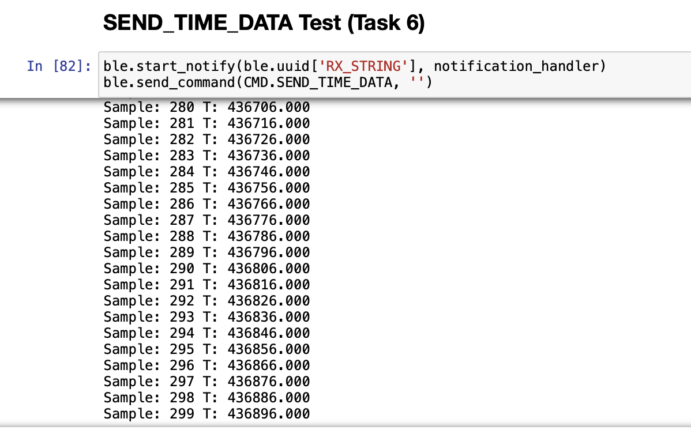

I implemented a global array on the Artemis board to store timestamp data before sending it in batches using the SEND_TIME_DATA command. This method reduced the overhead of continuous transmissions and allowed bulk data transfer when requested. The received data was logged in Python. 

### Task 7: GET_TEMP_READINGS

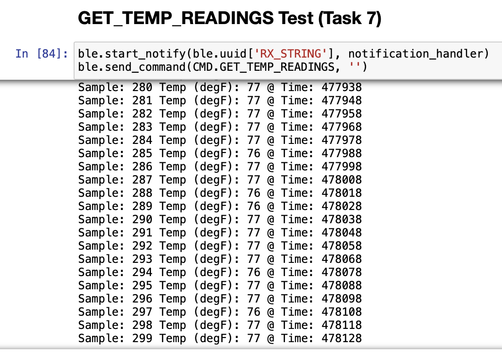

An additional array was introduced to store temperature sensor readings alongside timestamps. The GET_TEMP_READINGS command enabled the board to send both time and temperature data in a structured format.

### Task 8: STREAMING VS. DOWNLOADING

In this lab, we explored two methods of data transmission:

Streaming via Notifications: Data was transmitted continuously at a fixed rate of 43 payloads per second, ensuring a steady sampling rate. This method is ideal for real-time applications but has lower overall efficiency due to the smaller payload size per transmission.

Data Transmisssion via Stored Arrays: Data was collected over time and sent in larger chunks only when requested. This method is more efficient in terms of throughput, but the delay in receiving data makes it less suitable for real-time control applications.

For applications requiring constant monitoring, streaming is preferable due to its consistent sampling rate. On the other hand, the second option is beneficial when higher efficiency and larger data transfers are needed, such as in offline data logging.

The Artemis board has 384 kB of RAM. Given that each timestamp requires 4 bytes and each temperature reading requires 4 bytes, we could store 48,000 samples of each on the Artemis.

## Conclusion: 

This lab provided a strong foundation for understanding BLE communication and debugging. By implementing multiple data transfer methods, we explored the trade-offs between real-time streaming and downloading. These insights will be valuable for designing and using a robust wireless debugging system in future labs.
