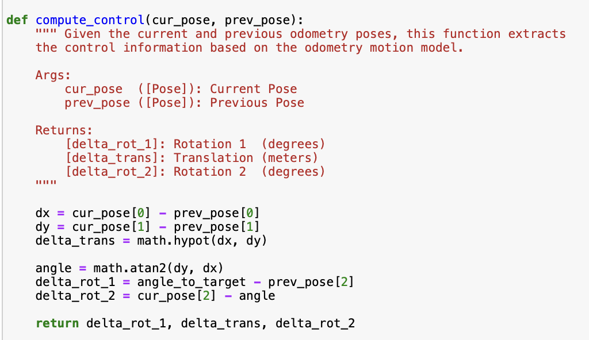
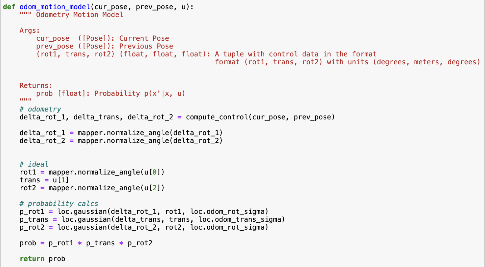
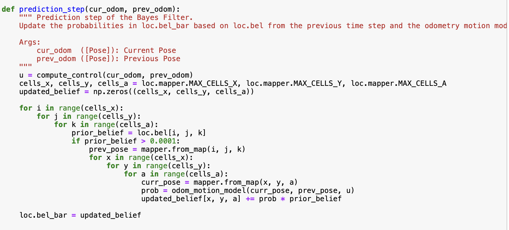
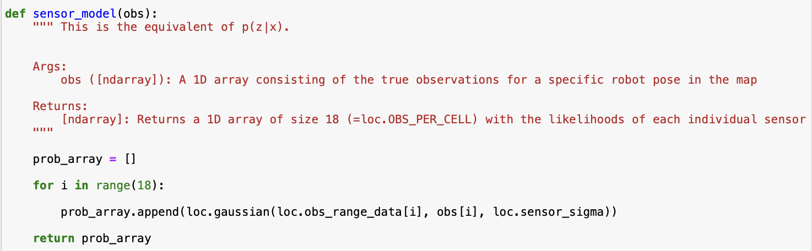
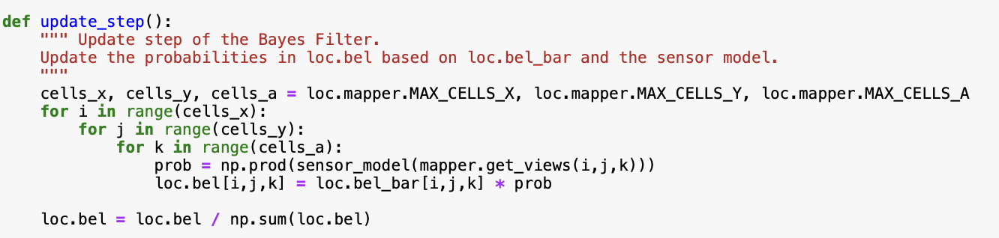
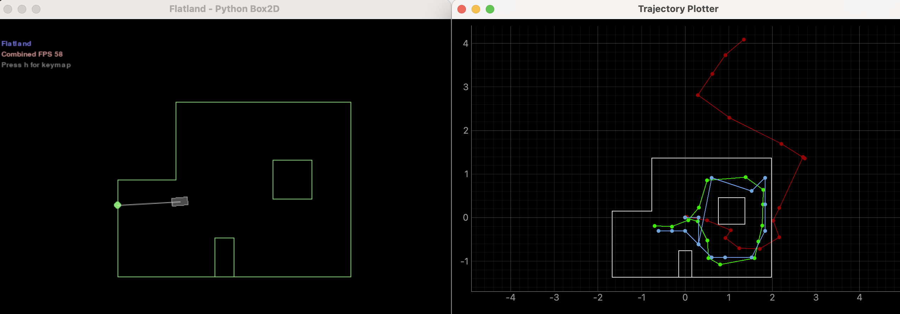

# Lab 10 (Grid Localization using Bayes Filter (SIMULATION))

## Bayes Filter

The Bayes filter estimates the robot’s position on a predefined grid by combining control inputs, sensor observations, and its prior belief about its location. For each grid cell, it calculates the likelihood that the robot is actually there, based on where it was before and the expected result of applying a given control action. It operates in two main stages: a prediction phase that projects the robot’s new state based on movement, and an update phase that refines this estimate using new sensor data.

## Compute_Control

This function calculates the necessary movement of the robot by comparing the robot's current and previous odometry poses. Each control input (pose) contains rotational and translational components and is represented by a tuple (x,y,yaw). The output of compute_control is rotation 1 in degrees, a translation in meters, and rotation 2 in degrees. 

Here is the code: 

## Odom_Motion_Model

This function takes the current pose, the previous pose, and the control input from compute_control, and outputs the probability that the robot is in the current pose. It does this by comparing the actual movement derived from odometry data, and the ideal movement the robot would take based on its prior state. Here, the ideal transistion is represented as a Gaussian distribution centered at the expected new state, given the previous state and control input. This gives us the probability $$
p(x' \mid x, u)
$$, or the likelihood that the robot is actually at position x'. 

Here is the code: 

## Prediction_Step

This function iterates over all possible prior states x_(t-1) to calculate the likelihood of the robot transitioning to each current state x_t given a control input(from compute_control) and the belief that the robot was previously at x_(t-1). This requires evaluating all combinations across the x-grid locations, y-grid locations, and orientation angles. As one might imagine, this gets computationally expensive. In order to minimize this, we ignore any previous location x_(t-1) with a belief of less than 0.0001. This noticeably sped up the filter's execution without significantly affecting accuracy. The output of this function is a new belief called bel_bar which captures the uncertainty of the robot’s location after a movement.

Here is the code: 

## Sensor_Model

This function computes the probability p(z∣x), which represents the likelihood of receiving a specific set of sensor readings given the robot's current state. It assumes a Gaussian distribution centered around the expected observation for that state, with a predifined standard deviation loc.sensor_sigma. As the robot rotates and collects 18 distance measurements in a full circle, the function calculates how likely each measurement is, given the predicted observation at that angle. The result is an array of likelihoods, one for each measurement, indicating how well the sensor data aligns with the expected values from the current state.

Here is the code: 

## Update_Step 

This function refines the predicted belief (bel_bar) by incorporating the predictions from sensor_model to produce the final belief distribution. For each possible robot state, the sensor model is used to compute the likelihood of observing the current sensor data from that position. This likelihood is then multiplied by the predicted belief value at that location. The result represents the updated belief that the robot is in that specific state. After processing all states, the distribution is normalized and then used to estimate the robot’s most probable location.

Here is the code: 

## Simulation Results

Here is a video of the simulation running: 

<iframe width="840" height="473" src="https://www.youtube.com/embed/QMSz2fuCir0" frameborder="0" allowfullscreen></iframe>

The most probable state after each iteration of the filter, it's probability, and the ground truth pose are displayed on the right side of the video for each point.

Here are the final simulation results (also shown at the end of the video): 

As you can see, despite the fact that the odometry model (red) is incredibly inaccurate, the prediction from Bayes (blue) matches the ground truth (green) quite accurately. That's pretty neat! 
