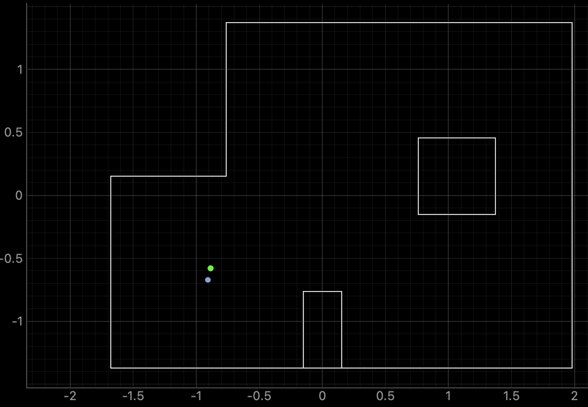
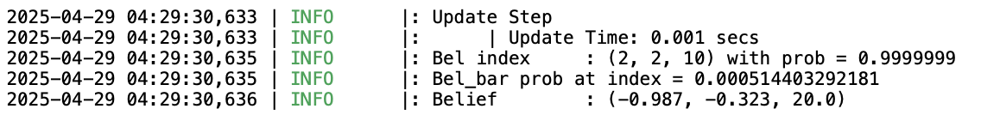
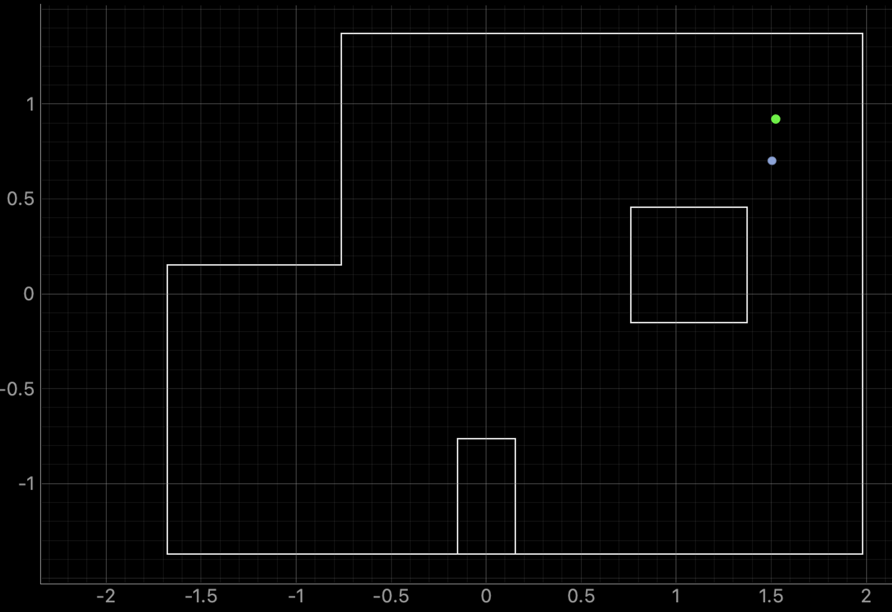
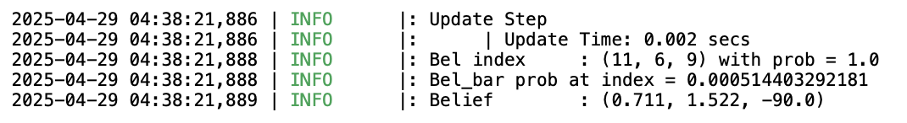
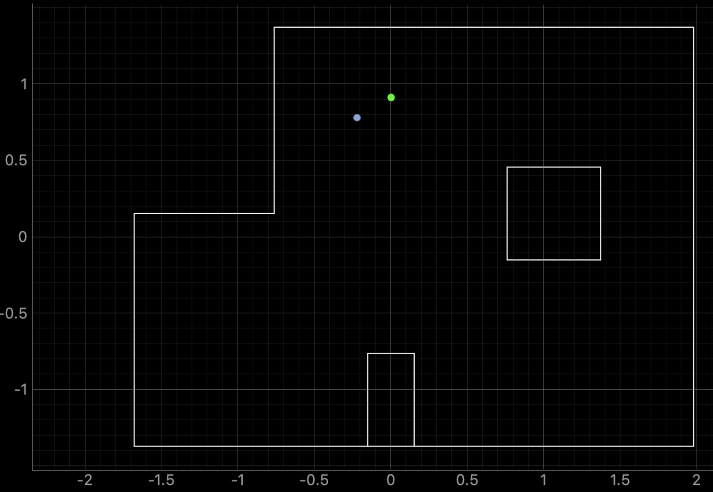
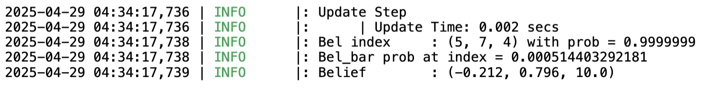

# Lab 11 (Grid Localization using Bayes Filter (REAL))

The goal of this lab was to perform localization with the Bayes filter from lab 10 on my physical robot. This involved combing the simulation work from lab 10 with room mapping from lab 9. To begin, I set up the base code by copying lab11_sim.ipynb and lab11_real.ipynd into my notebooks directury and localization_extras.py into the root directory. I also copied base_ble.py, ble.py, connection.yaml, and cmd_types.py into the notebooks directory so that Bluetooth communication with my car worked correctly. 

## Localization Simulation

Once I had my python environment set up, I tested the Bayes filter using the simulator. Here is a photo of the end result: 

As you can see, the belief (blue) is very close to the ground truth (green) despite the odometry model (red) being very incorrect.

## Code Changes

The code on the Artemis side was very similar to that from lab 9. I adjusted the number of increments to 18, rotating 20 degrees every increment. An additional change I made was to create a new case that sent over my stored data seperately. 

On the python side, the perform_observation_loop function calls the MAP_ROOM case from lab 9 as well as the new send data case. 

## Localization Results and Discussion

Here are the localization results from each point: 

Point (-3,-2)

Point (5,-3)

Point (5,3)

Point (0,3)

For all of these points, the localized pose is very close to the ground truth. Shockingly so, in fact. There is some veriation, but to be honest it is pretty small. The biggest difference is in the angle values. These diffrences may be due to drift in the robot, as it occasionally shifted on its axis as it turned. However, I'm very happy with these results going into lab 12.