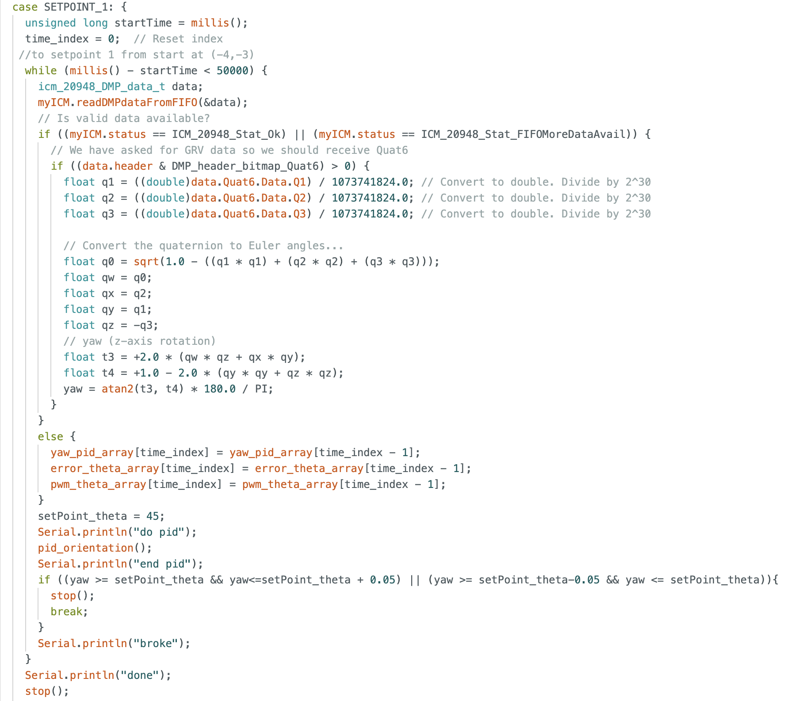
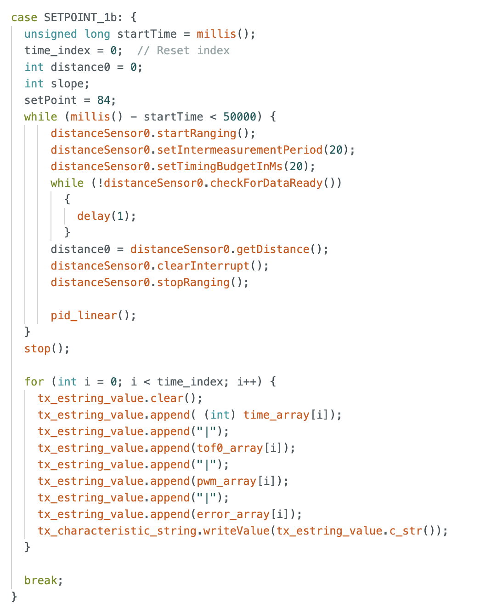
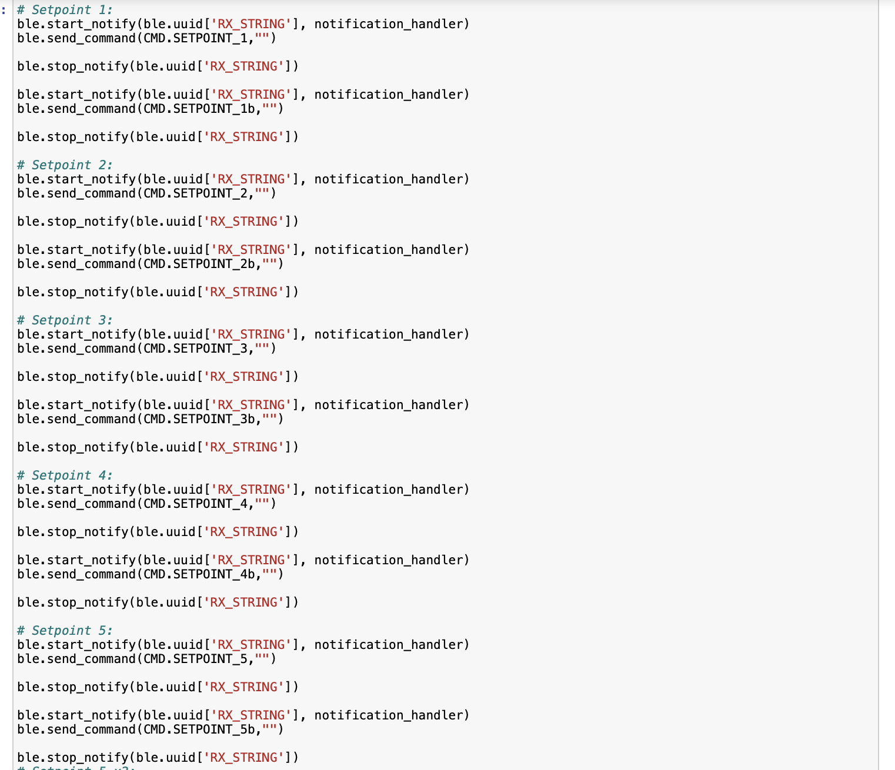

# Lab 12 (Path Planning and Execution)

## Objective

This lab brought together all the components developed throughout the semester to get the robot to navigate waypoints within a maze. The goal was to design and implement a path planning and control strategy to move the robot as accurately and efficiently as possible through these waypoints.

## Planning

The waypoints to hit were: 

    1. (-4, -3)    <--start
    2. (-2, -1)
    3. (1, -1)
    4. (2, -3)
    5. (5, -3)
    6. (5, -2)
    7. (5, 3)
    8. (0, 3)
    9. (0, 0)      <--end

I initially planned to use localization, but after running into significant issues, I switched to a simpler but reliable approach using only PID control. I decided to first complete a successful run using hardcoded PID setpoints, and then return to localization if time allowed (unfortunately it did not :/).

I decided to have my car drive along the most direct path between each waypoint. I know some people limited their robot to 90 degree turns, but my PID control has been fairly successful, and I felt confident in the controller’s ability to handle non-perpendicular headings.

The overaching control structure for this lab involved defining a separate case for each waypoint in my Arduino code, with both orientation and linear PID logic to guide the robot. Commands were sent over BLE from Python, triggering each waypoint’s corresponding routine. This modular setup made it easy to test and debug segments of the path individually.

## PID Control

A major challenge in this lab was tuning the orientation PID controller after removing the tape from my robot’s wheels (removed for stunt demo). I didn’t want to reapply the tape (sticky residue = bad), so I had to adjust the minimum PWM value to find the sweet spot between "not enough torque to move" and "spins out wildly while approaching the setpoint."

The biggest complication was that this optimal PWM threshold would shift as the battery voltage dropped. Since this lab required many trial runs, I spent a lot of time swapping or recharging batteries. This variability made tuning especially frustrating.

## Results

### Best attempt 1: 

<iframe width="840" height="473" src="https://www.youtube.com/embed/8SwcipIW5Bc" frameborder="0" allowfullscreen></iframe>

As you can see, despite the fact that the robot does make it to the end and generally performs well, there is a spot or two that it needs some help on. The corner at waypoint (5,-3) and (5,-2) was a repeated problem. It's a tight turn, and my car doesn't always like to drive in a straight line. 

### Best attempt 2: 

<iframe width="840" height="473" src="https://www.youtube.com/embed/8SwcipIW5Bc" frameborder="0" allowfullscreen></iframe>

This run my robot was a little low on battery. As a result, it required a nudge at (-2,-1) to complete the 90 degree turn. Also, the car tends to drift more when it's low on battery and as a result it got a little stuck in the corner at (5,3). I think if my battery was charged this would have been a pretty much perfect run. 

### Localization

Unfortuntaely I was unable to get path planning that used localization to work correctly for this lab. Here's a video of my robot spinning in a circle though: 

<iframe width="840" height="473" src="https://www.youtube.com/embed/XKt81ngWo9A" frameborder="0" allowfullscreen></iframe>

## Conclusion

This has been a great semester and I really enjoyed taking this class! Special thanks to Prof. Helbling and all the TAs for their support throughout the course.

P.S. Thanks for setting up the second world outside the lab - that was incredibly helpful. 