# Lab 2 (IMU)

## Set Up The IMU

### Artemis IMU connections: 

### IMU Example Code: 

[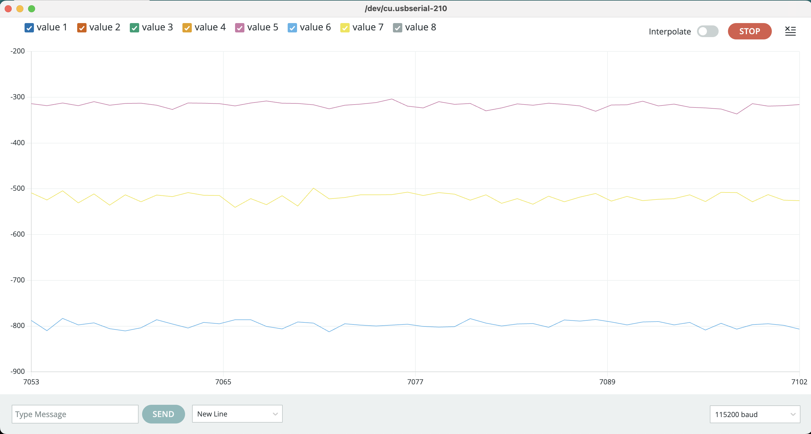](files/example_basic_works.mov)

### AD0_VAL Discussion:

AD0_VAL is the LSB of the 7 bit I2C address. For us, it gets set to 1 because that's the default value when there is only one IMU sensor on the I2C bus - the ADR jumper is not closed. 

### Accelerometer vs. Gyroscope

The accelerometer graph represents the IMU data precisely as one might expect it to. As the board increases in spead along an axis, the plot shows an increase along that axis, and the opposite is true as the board speed decreases along an axis. It is also notable that different from the accelerometer, the gyroscope measures angular rotation. When you rotate the board on a flat plane the gyroscope registers the change while the accelerometer does not. 

I also added LED blink statements to the board set-up code so that I can visually verify that the board is running when I want it to be. 

## Accelerometer

I used the equations from class to convert the x,y,z accelerometer data into pitch and roll. It is mathematically impossible to get yaw with the accelerometer, so I only looked at pitch and roll. Here are some graphs of the data while the IMU is in various positions: 

### Roll and Pitch at 0 degrees: 
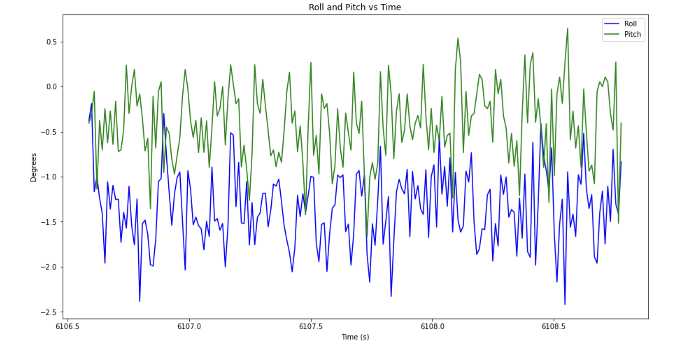

### Roll at 90 degrees:

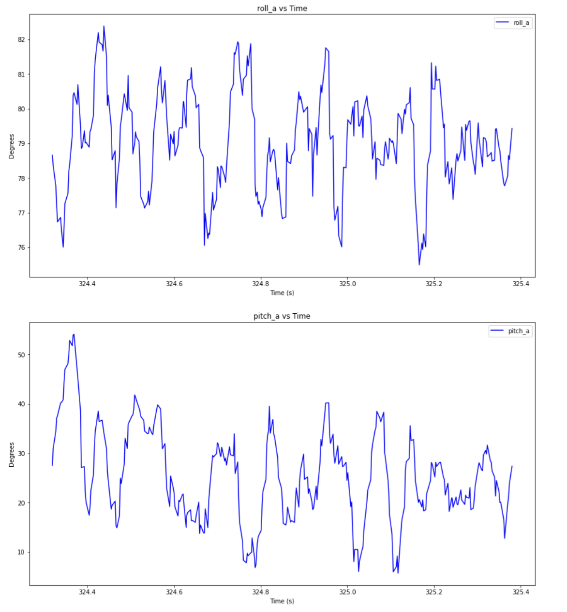

### Roll at -90 degrees:

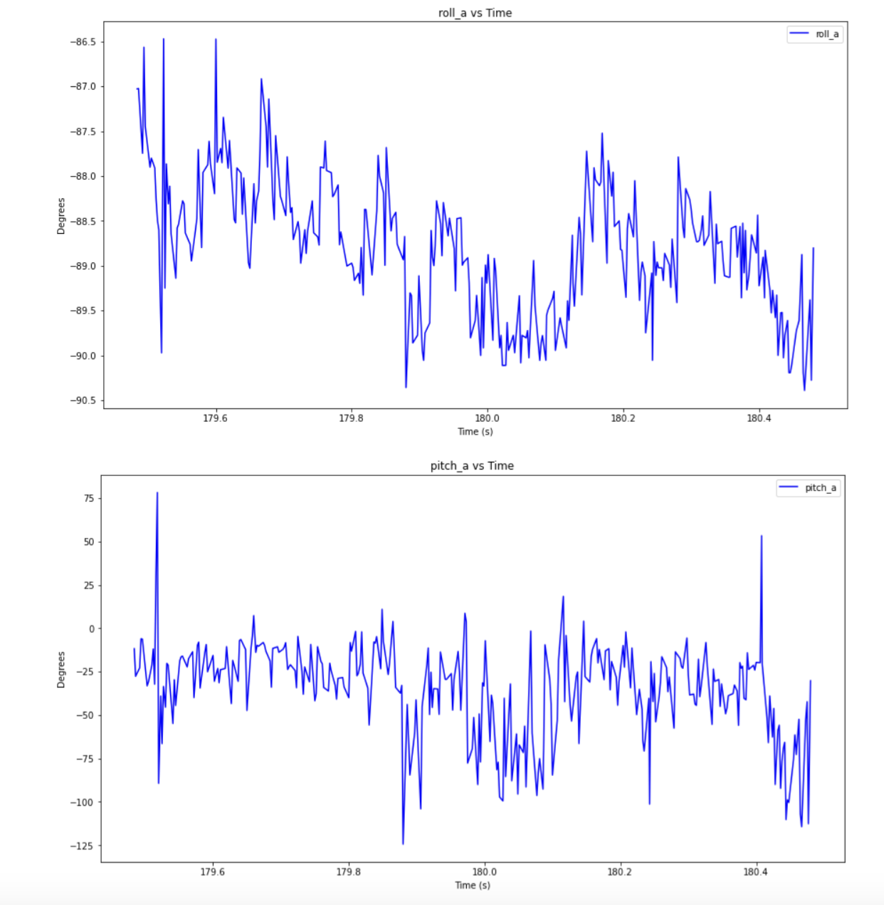

### Pitch at 90 degrees:

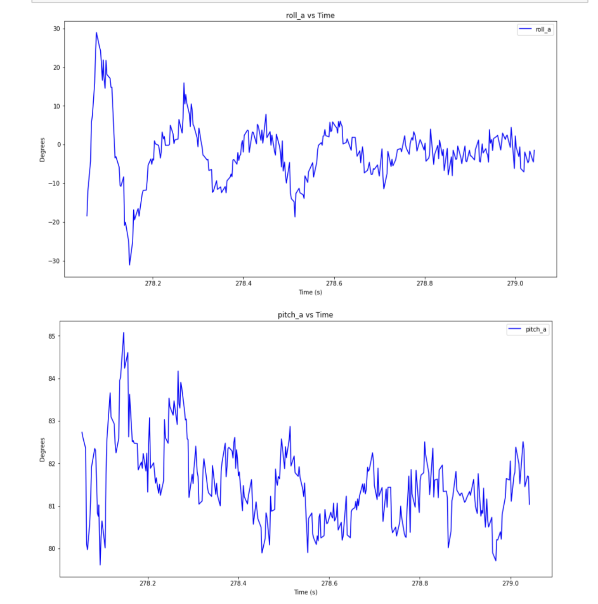

### Pitch at -90 degrees:

One thing to note in each of these graphs, when roll or pitch are at +/- 90 degrees the other value is incredibly noisy and very jumpy. 

### Here is an analysis of the noise in the system: 

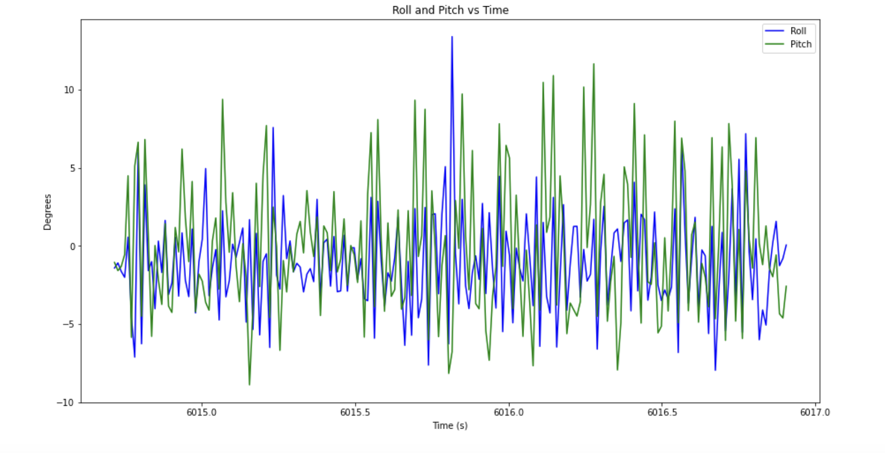

### Fourier Transform of data when IMU is flat and not moving:

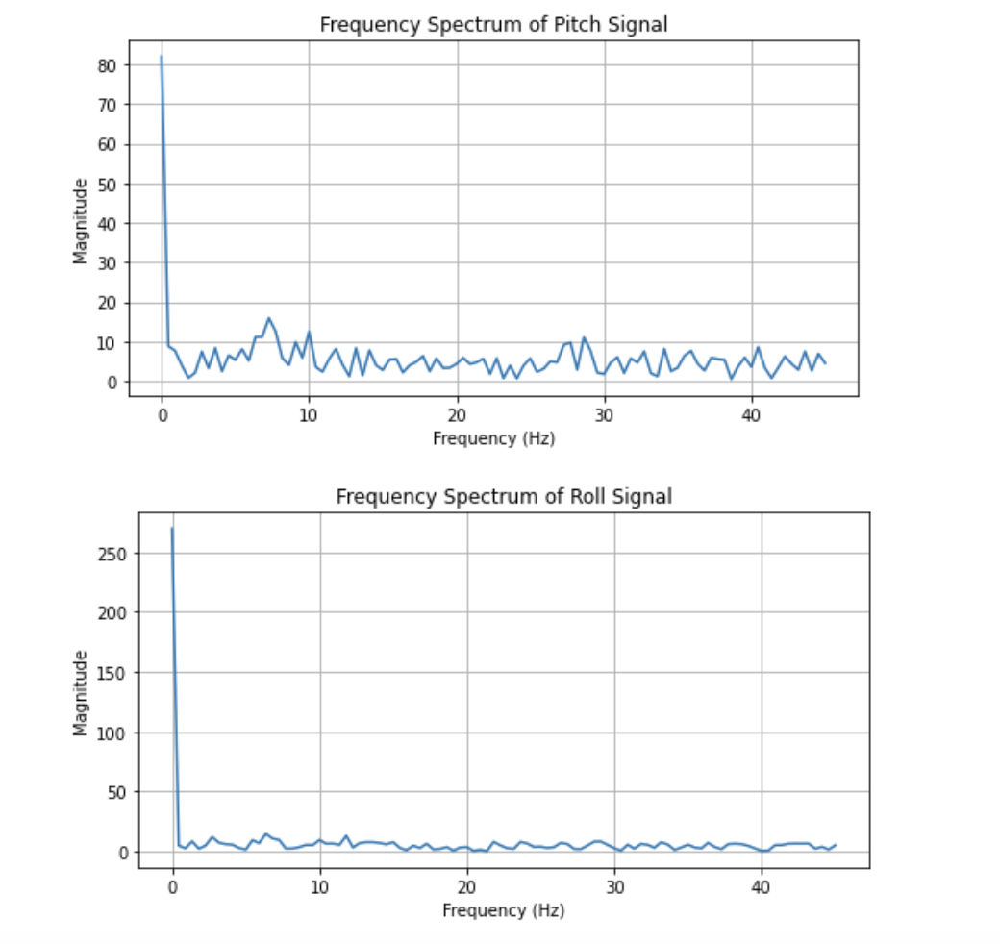

I used a cut-off frequency of 5Hz as that is just past the large spike in amplitude on the FFT graph. 

I used this information to implement a low-pass filter. Here is the filtered data while the IMU is flat and not moving: 

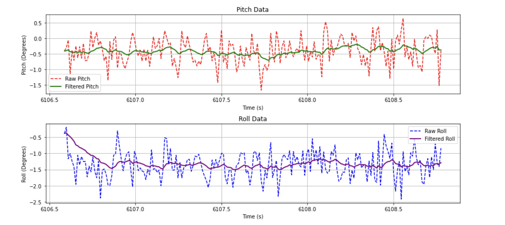

I also shook the table slightly to introduce more noise into the system - which you can especially see in the frequency response of the pitch signal. The following is the fft and low pass filter graphs of the noisier data. The filter did a really good job of filtering the noise. 

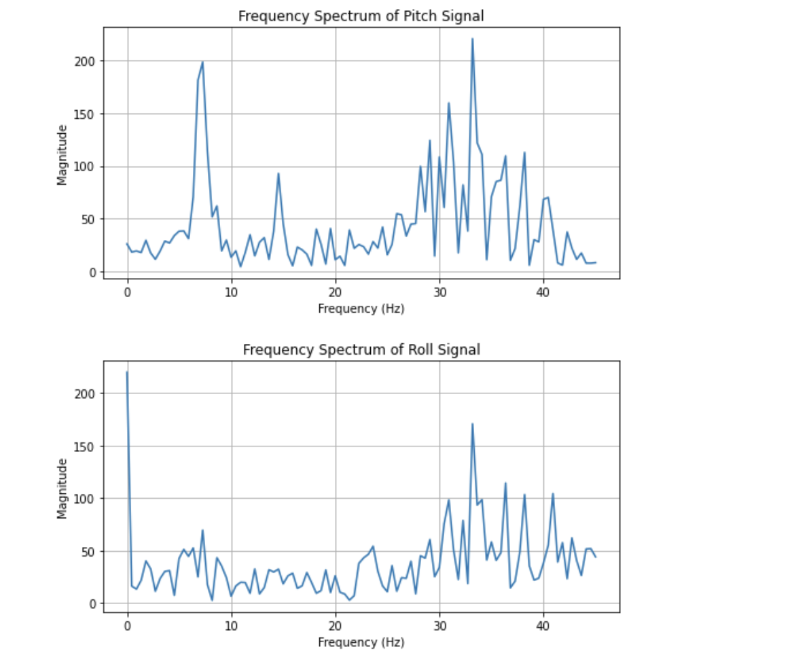

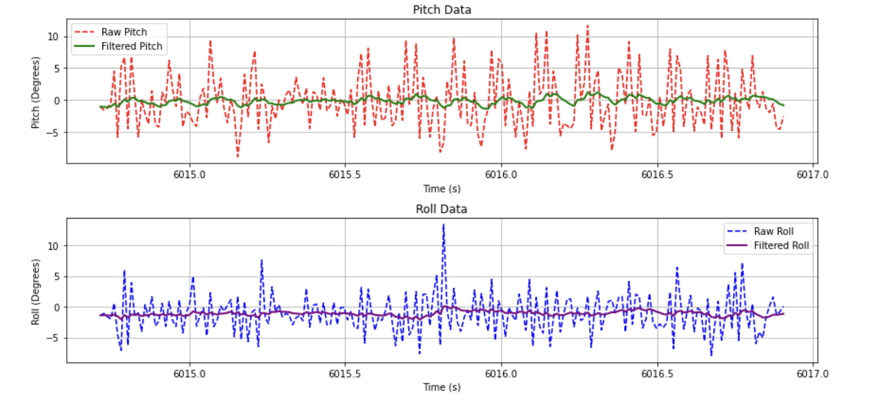

## Gyroscope

The gyroscope data was collected in a similar manner to the accelerometer data. The math was a little bit different and, most notably, we get yaw data in addition to roll and pitch. Some other differences: While the accelerometer is very noisy, the gyroscope sees less spikey inconsistencies. However, the gyroscope data does drift. If I rotate the IMU several times the start and end point values are not the same with the gyroscope. The following graphs compare the accelerometer and gyroscope data well: 

This one is with the filtered acceleration data: 
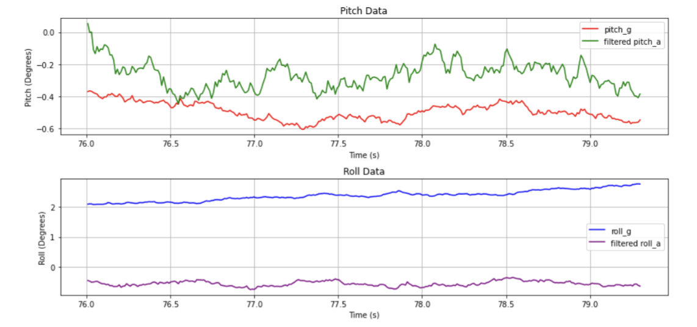

This demonstrates the drift: 
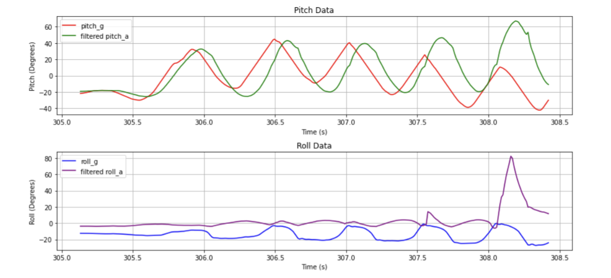

One thing to note is that with a lower sampling rate the drift increases. 

One way to avoid the problems caused by noisy accelerometer data and drifty gyroscope data is to combine the two with a complementary filter. 

The following is are some graphs of the accelerometer data, the gyroscope data, and the complementary filtered data: 

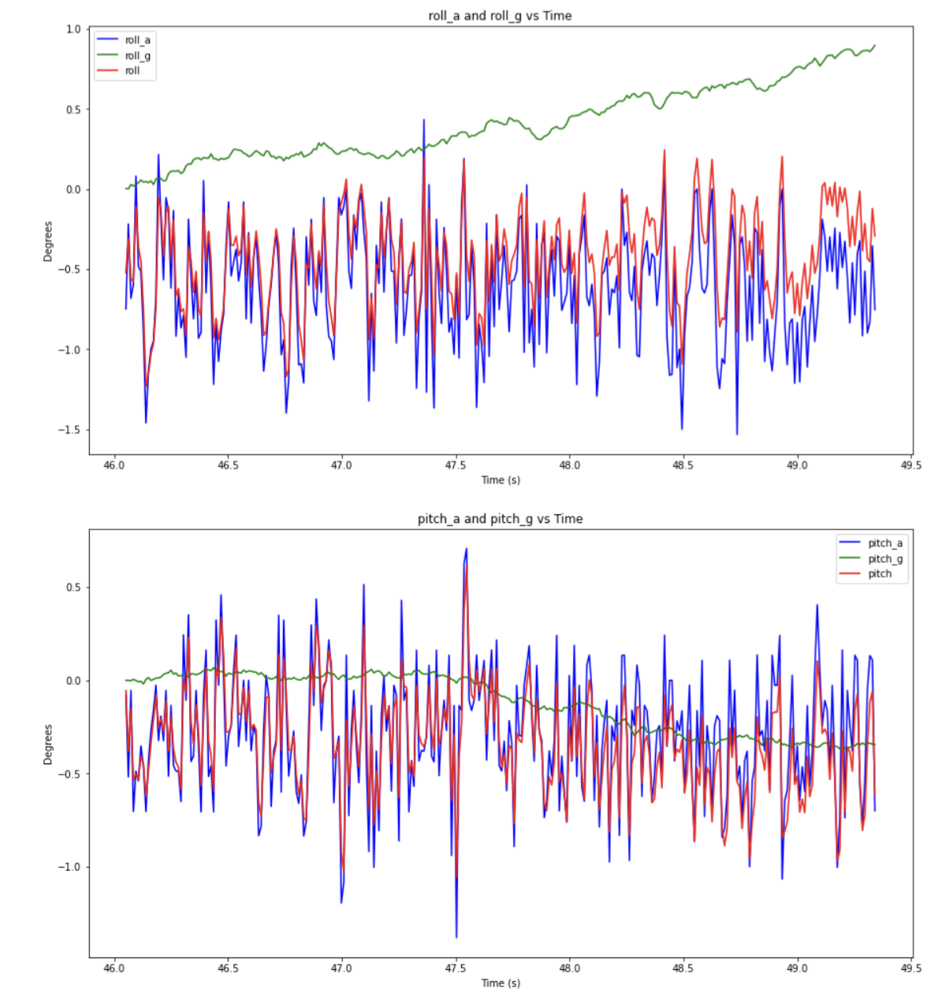
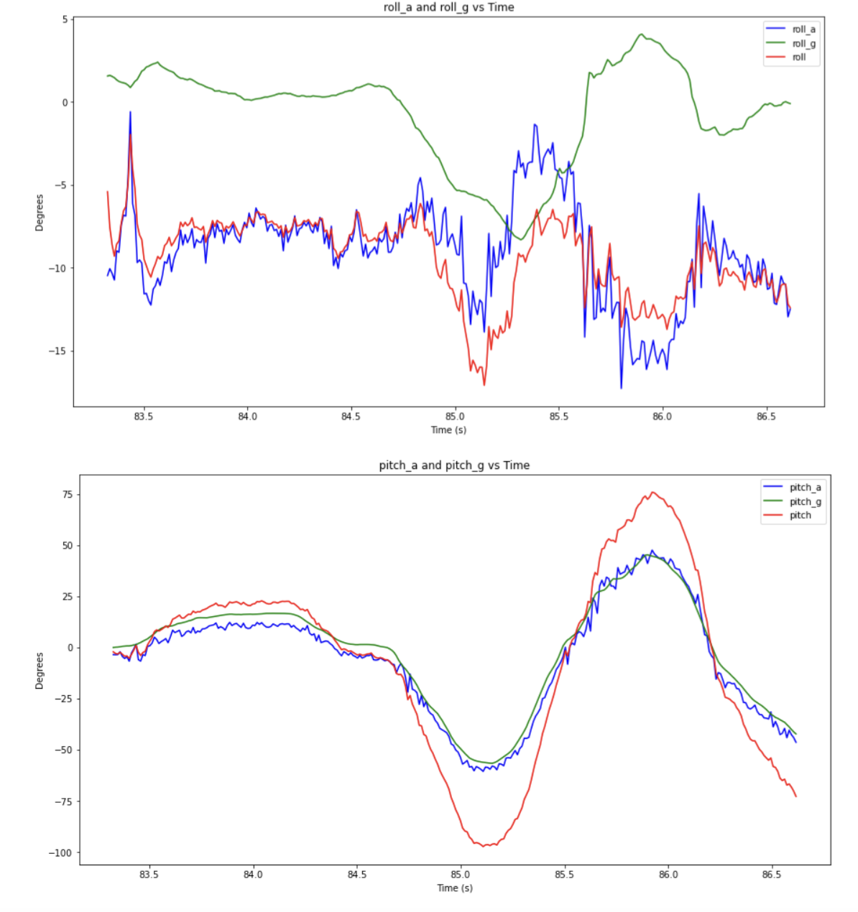

I ended up weighting the accelerometer data more because of the drift on the gyroscope data. 

## Sample Data

### Timing analysis

I got rid of all of the delays in my data collection loop and deleted all of my print statements. This allowed me to get approximately 1500 samples in 5 seconds. Specifically I had a sample rate of 1478/5 = 296 Hz. This could be optimized further, but that would require major changes to my code. Each sample contains different data than the previous sample so I'm not yet reading faster than my sensor provides data.

### Data Storage: 

Memory usage remains the same whether the data is stored in multiple arrays or a single one, but keeping them seperate makes my life as a programmer easier. It's easy to follow and just generally feels more organized. As far as data types are concerned, strings are really big and very memory-inefficient. It would be better to just send floats instead of converting floats to strings, sending the data, and then converting the string back to a float. Floats give a bit more data than integers do but either would probably be fine. Strings are just the worst choice for memory - perhaps in the future I'll tackle that problem in the BLE file. The Artemis has 384 kB of RAM and my program takes up 19% of that. then that leaves me with around 311 kB of memory. That leaves over 8000 as the length of my data arrays (assuming 9 arrays of floats). That's not actually that much data - it comes out to around 30 seconds of data. 

### Demonstration of 5s of Data

I increased the flag in my data collection while loop so that data was collected for 5 seconds. I also significantly increased the size of the array and labeled each data point with an index as well as a time stamp so I knew how many samples were being taken and how often. 

Time-stamped arrays: 

Start time: 
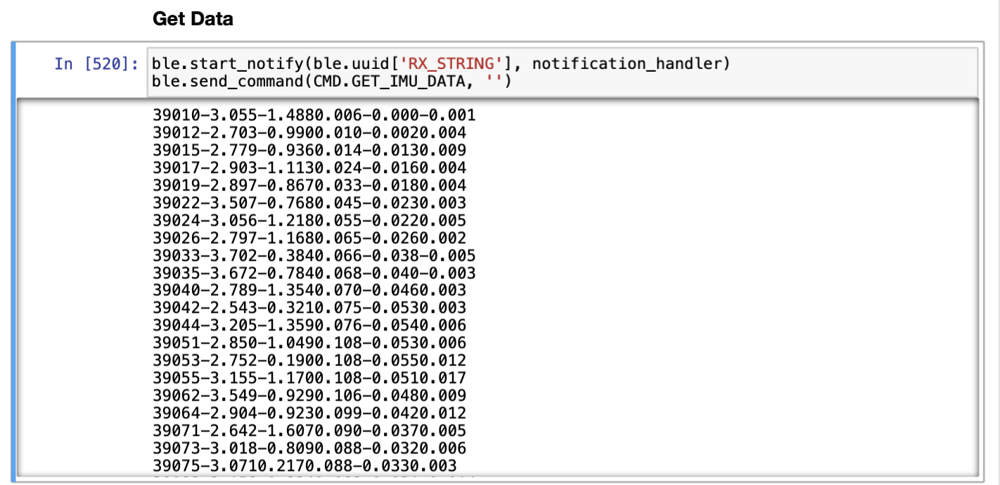
End time: 
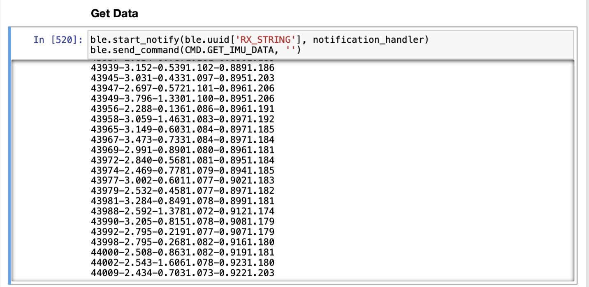

## Stunt!

