### Lab 3 (ToF)

## Prelab

### I2C Address

From the data sheet for the Time of Fight (ToF) sensors, we know that they use I2C  to communicate with the Artemis board. The data sheet also tells us that the address of one sensor should be 0x52.

### 2 Sensor Approach

The car will have two ToF sensors. Both sensors have the same I2C adress, so we will need to set one of the sensors to a different address in order to differentiate them and use them at the same time. This is where the XSHUT pin is useful. It shuts down of the ToF sensors which allow us to communicate with the other and change it's I2C address. Then we can reboot the other sensor and use both at the same time. The XSHUT pin is connected directly to the Artemis. 

### Wiring Diagram and Sensor Placement

This is a diagram of the wiring. I chose to use both the longer cables for the ToF sensors as I am more likely to move them to different positions on the car for different types of labs. I see two useful configurations of the sensors. The first possibility is one on the front and one on the back which will be useful for determining what's around the robot as it goes forward, backward, and flips over very quickly. The second possibility is one in the front and one on the side which will be useful for mapping out the room or following a wall. I will likely start with one in the front and one in the back as I believe the next few labs involve doing stunts. However, using the longer cables for these sensors means that if I discover these aren't optimal configurations they will be pretty easy to move. The IMU will get the short cable because it is unlikely that it will need to be moved and the placement will probably be more central on the car than the ToF sensors. 

## Lab Tasks: 

# Soldering

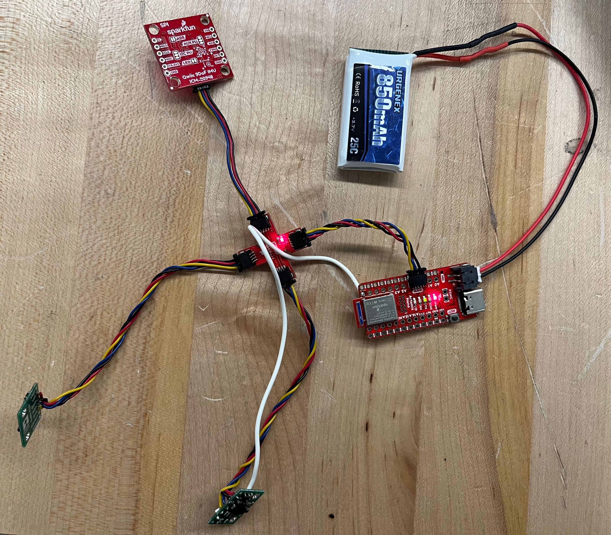

Here is a photo of all of the wires (battery, and ToF sensors) soldered and connected to the Artemis. 

# I2C Adressing

Here is a photo of Artemis scanning for an I2C device. As you can see, it finds a device with the address 0x29. This is slightly surprising as the datasheet tells us the device should have an address of 0x52. However, closer reading tells us that I2C uses the LSB as a Read/Write indicator bit. Ignoring the LSB turns 0x52 into 0x29, and the address makes sense. 

# Sensor Data Mode

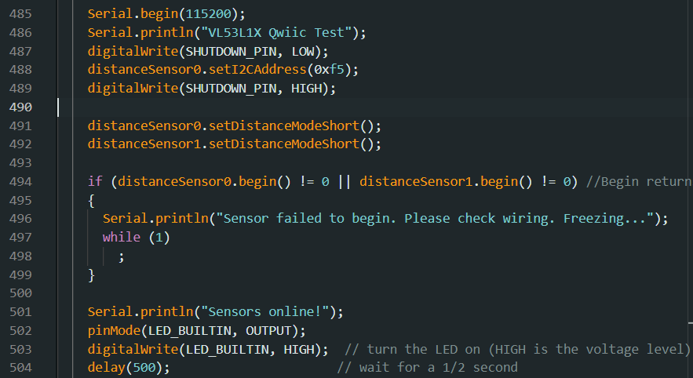

The default mode for the two ToF sensors is the long mode. However, after reading the data sheet I decided that short mode would be more useful. I put both sensors into short mode during setup (code snippet shown above). While long mode can sense up to 4 meters and short mode can only sense up to 1.3 m, there is a tradeoff with accuracy. For now, I believe that the lack of distance is worth the higher accuracy, but of course when I start actually doing stunts with the car my opinion might change. Luckily it's very easy to switch between the two modes (just one line of code per sensor). I also suspect that I might end up having one sensor in long mode and one in short mode in future labs. 

# ToF Sensor Range, Accuracy, Repeatability, and Ranging Time

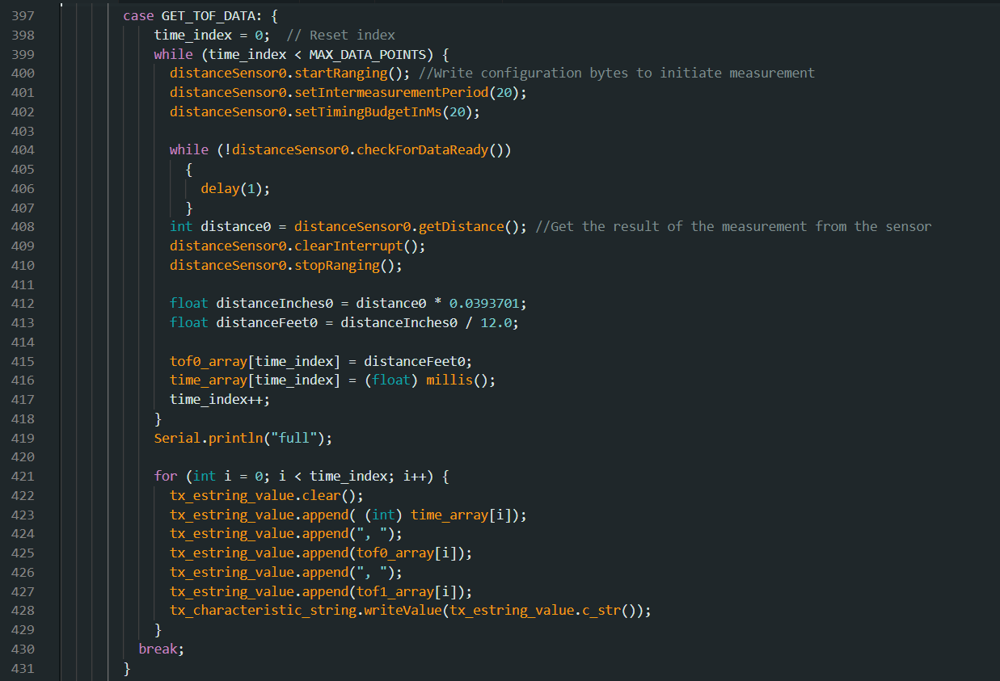

The first variable I started testing with was ranging time. With all of the sensor data I collect I also record the time stamps and send both sets of data over together. That makes looking at timing easy - it's just a matter of looking at how many data points are sent within the time difference of the first and last time stamps. I started the testing process by running for 10 seconds and printing out all the data I collected - I was surprised to see a serious lack of data. I then changed my code so that it didn't stop running until it had collected a certain amount of data points (I started with 1000 data points then tried 2000). With default timing it takes a really long time to get a decent amount of data (a really long time = more than a minute). By reading further into the Sparkfun library as well as discussing with my fellow classmates, I discovered that there are two functions that have a huge effect on timing. There's setIntermeasurmentPeriod() and setTimingBudgetInMS(). The first of these functions sets the amount of time between measurements and the default is 100ms. I reduced this to 20ms and saw a little bit of timing improvement. The big improvement, however, came when I also changed setTimingBudgetInMS(). This function sets the amount of time it takes to take a measurement. I also set this to 20ms and saw a serious improvement in the amount of time it took to collect data. 20ms seems to be the minimum for both values. Any lower and they reset to default. I ended up being able to collect about 1000 data points in 20 seconds. 

Next I set up a testing system with a measuring tape so I could measure range and accuracy. The following is what the test set up looks like. 

(Photo credit to Selena Yao, we shared a test setup)

I positioned the sensor in a fixed location and moved a box 0.5 ft away from it every few seconds. The following is the plotted data I from the test. 

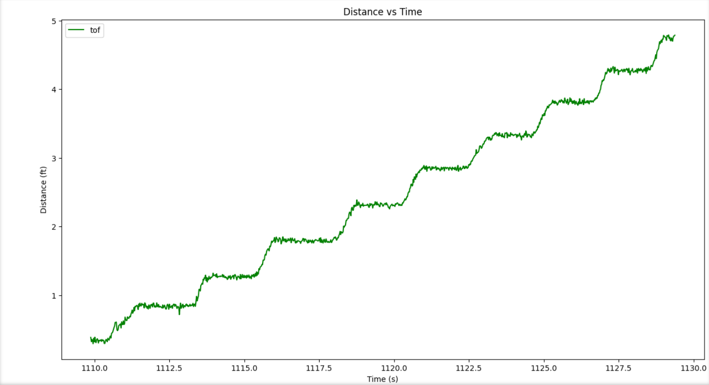

Each plateau represents the intervals I stopped at, starting at 0.5 ft distance and increasing by intervals of 0.5 ft up to 5ft. The measured distances line up pretty accuractly with each real distance, though there is clearly a larger difference between measured and actual at 5ft then there is at 1ft. I further tested the accuracy of the sensor by recording several seconds of data at a fixed 1ft and a fixed 5ft. The data from those tests is graphed below.  

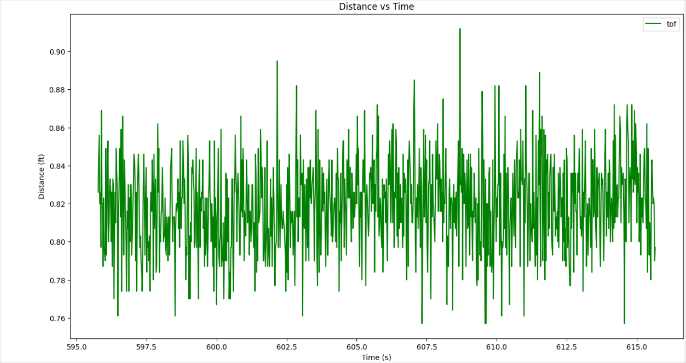

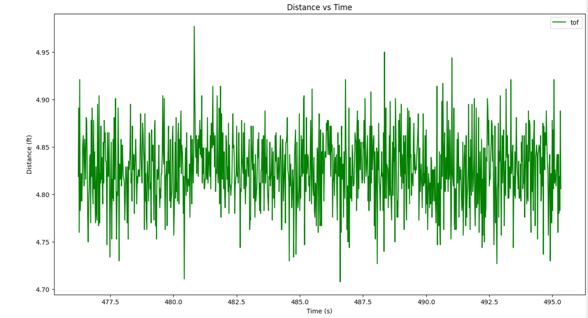

As you can see, neither is exact, though they are pretty close. Both data sets were off by about 0.15ft. Because this is so consistent it will be easy to filter out the error. 

I also tested repeatability by running the moving box test several times. Here is another set of data I collected by running the same test. As you can see, it is quite consistent with the first set of data. This means the sensors give repeatable data. 

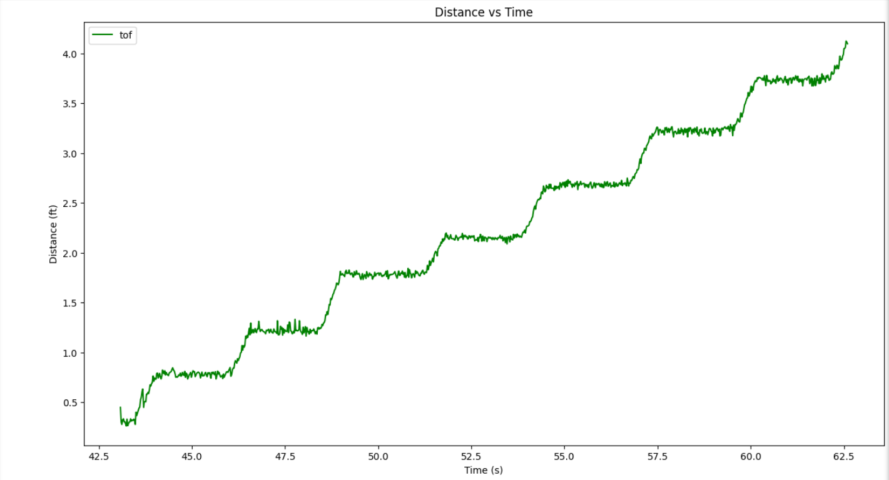

# Time vs Distance (2 sensors)

After verifying functionality with one ToF sensor, I switched to adding the second one. I talked about addressing the second ToF sensor earlier in the lab report so I won't repeat that explanation. Here, however, is what my new case looked like for collecting both sensors data at the same time. 

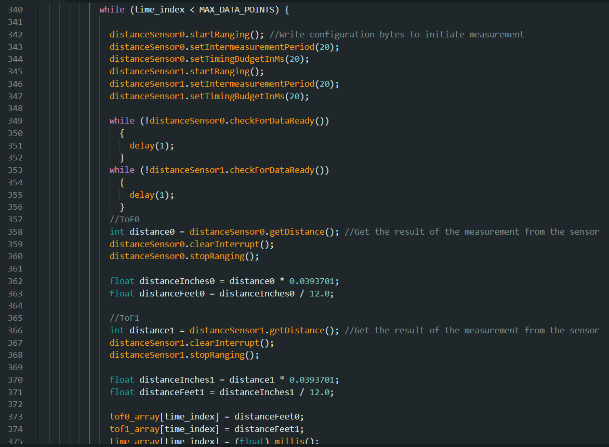

The way I confirmed functionality is by taping the sensors on either side of an object and moving it back and forth between two walls of a hallway (credit goes to Kelvin Resch for this idea). The hallways was of length 7.5 ft. This is slightly out of range of the short distance mode and you can see the data gets a bit noisy when the distance gets that far away. I thought that dispite this the sensors performed pretty well and it is very clear that the two ToF sensors are collecting unique and correct data.

As usual, Celsius is the answer to all my problems. I repurposed the remnants of my latest caffeine source to mount both sensors across from each other and execute this test. A liberal amount of duct tape kept each sensor in place as well as preventing anything from shorting to the can. 

[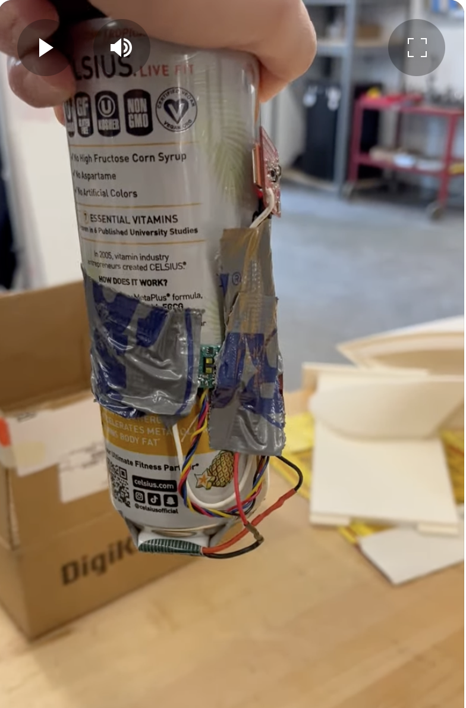](https://youtube.com/shorts/uySNXMk325A?feature=share)

Here is the results of the hallway test: 

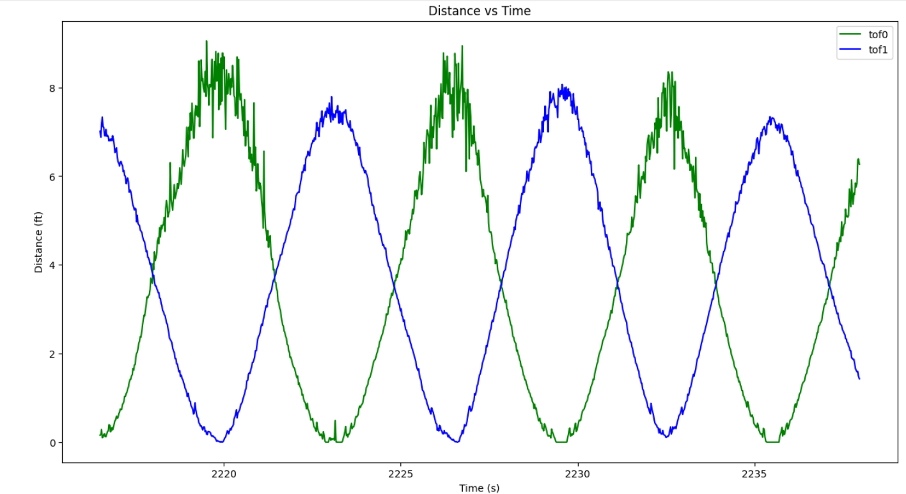

# ToF Sensor Speed

I collect 1000 data points in about 20 seconds, which is a 50 Hz data collection rate. This is not super fast. In order to investigate timing further, I printed the amount of time in milliseconds that it takes to run the main while loop. I did this by recording the time at the beginning, at the end, and then printing the difference. I saw that this result averaged about 8 ms. Overall, these sensors are pretty slow, and I am pretty sure the checkForDataRead() loops are the main thing that slows things down. Occasionally the timing jumps to 11 or 14 ms, and I think that jump happens when the data is ready. Overall, this seems to be a slow sensor. 

# Two ToF sensors and the IMU

After confirming both sensors worked together, I also added the IMU. Here is a graph of all three sources of data getting streamed together. I recorded the data while moving the two ToF sensors between two walls and spinning the IMU. 

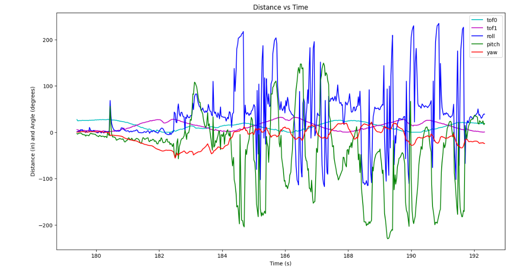

Here are graphs of the same data but seperated into IMU data and ToF data. 

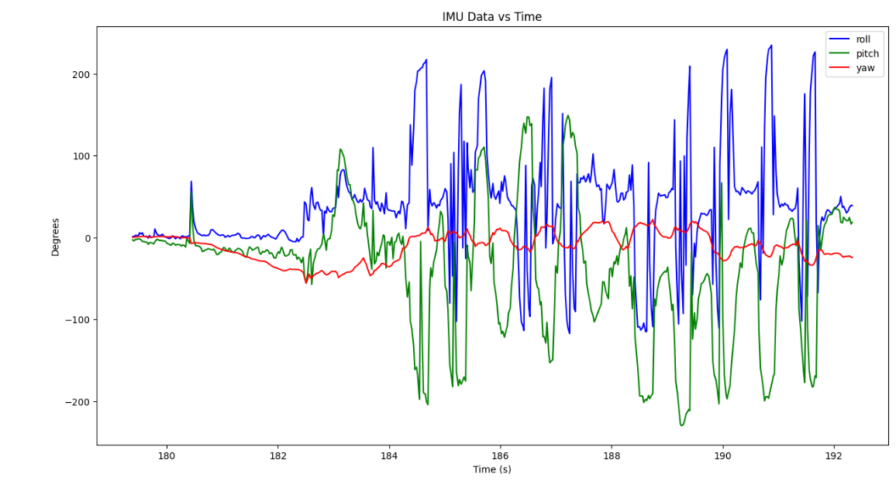

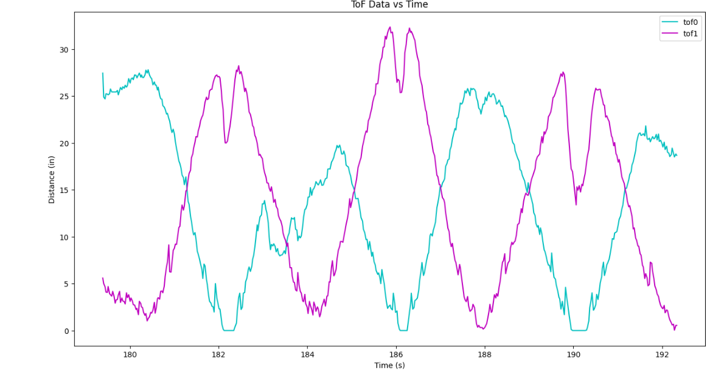