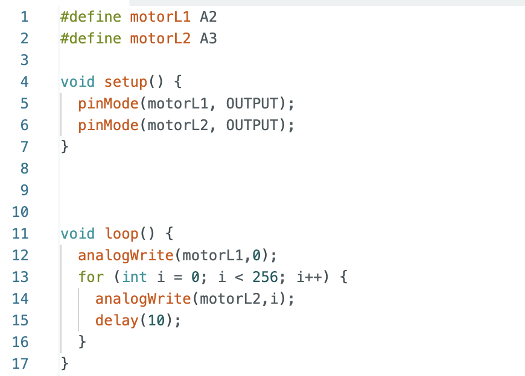

# Lab 4 (Motors and Open Loop Control)

## Prelab

### Diagram

For the first part of this lab I mapped out all of my connections for the motor drivers and thought about how I would mount things to my car. Here is a diagram of the connections: 

The following were connected: 

- GND: Connected to both Artemis and negative battery lead on both motor drivers
- Vin: Connected to the positive battery lead
- AIN1 and BIN1: Connected to each other and to Artemis pins A2 and 4 (one for each driver).
- AIN2 and BIN2: Connected to each other and to Artemis pins A3 and A5 (one for each driver).

### Battery Discussion

The motor drivers and the Artemis are each powered by their own batteries (Artemis by a 650 mAh battery and motors by a 850 mAh battery). This is because the current draw of the motors is significantly higher than that of the Artemis. Seperating the paths is good practice in order to prevent noise from the motors affecting the sensors. 

## Lab Tasks

### Power Supply and Oscilloscope Setup

I set my power supply to about 3.7V. The 850 mAh battery we use is 3.7V nominal. In actuallity it probably ranges from about 3.2V to 4.2V so any value in that range would work. I set the current limit at 2A because that's the max current the motor drivers can handle. However, it is worth noting that I don't anticipate reaching anywhere close to 2A while testing on the power supply.

### Testing the Drivers Off the Car

I used the above code to loop through the different PWM values and analogWrite them to one of the channels on a single motor. I repeated this for both directions on both motor drivers. 

Here are the Oscilloscope results from the above test: 

Here are videos of the wheels spinning while on the power supply. I tested both motors individually and then together for both forwards and backwards motion. 

On power supply: 

### Wheels Spinning (with battery)

Next I tested both wheels spinning at the same time both forward and backward. This test was on the battery, not on the power supply. At this point I had all of the electronics soldered together but just piled on top of the car and not integrated neatly. That comes next. 

### Components in the Car (Labeled)

### Lower Limit PWM

I incrementally decreased PWM until the robot stopped moving, and then increased again by 5 to find the minimum PWM necssary to overcome friction. To start the car from rest and move forward, the PWM value necessary was about 35 PWM. However, when turning I needed a higher PWM. To turn from a resting state I needed about 90 PWM. 

### Calibration and Open Loop Control

When I first ran the vehicle on the ground there was a very significant drift to the right. I fixed this by multiplying the PWM signal on the left motor by some constant. I found this constant by picking a random number (1.5), testing with it, and then decreasing or increasing it based on the test. I also noticed that this value changes at higher and lower PWMs. I found a few constants that work with common PWM values I was testing with. I listed them in a comment in my code for future reference. At a PWM of 70 I found the calibration constant that worked the best was 1.3 and at a PWM of 100-150 I found a calibration constant of 1.2 worked best. The faster the car goes the lower the calibration constant.

Here is a photo of my testing set-up:

Here is a video of my car moving in a straight line for 6 ft.

I also had my car perform a combination of movements to prove control. Here is a video of my car moving forward, backward, and turning on the spot. 

