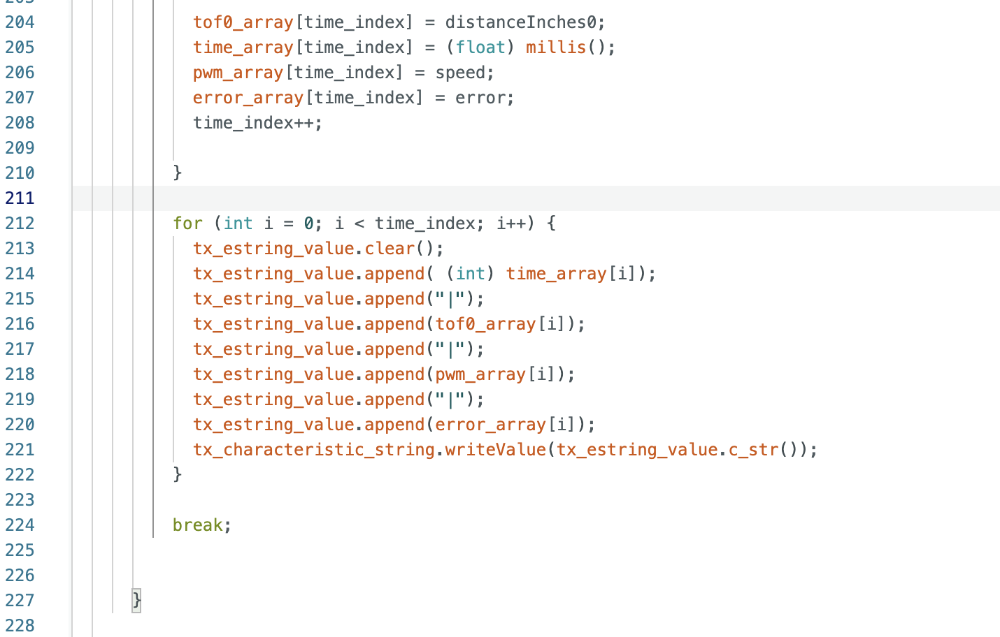
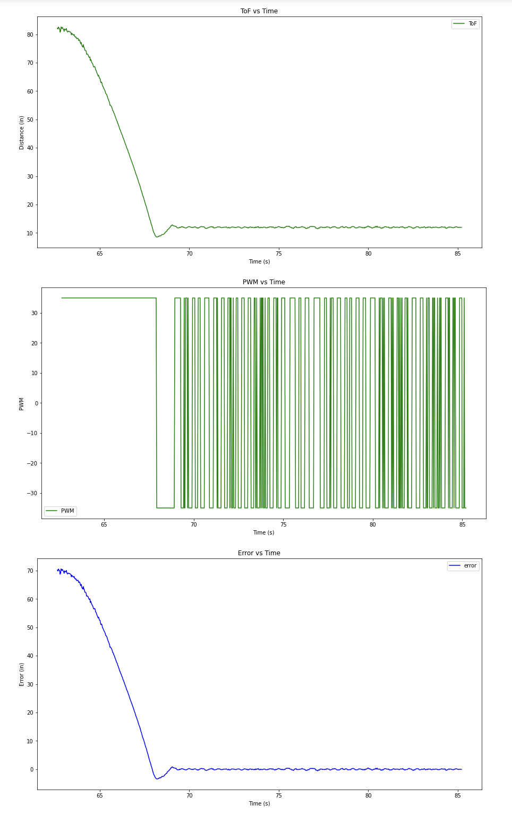
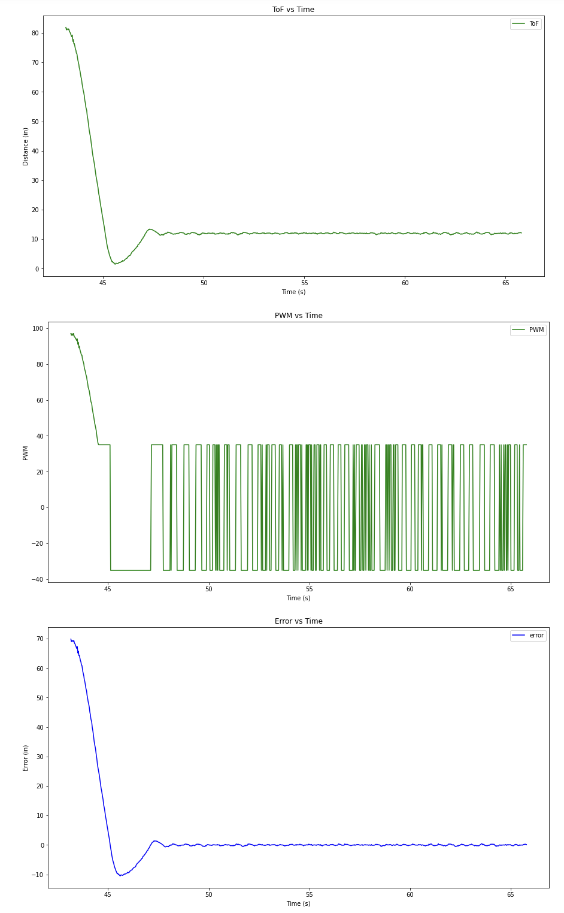
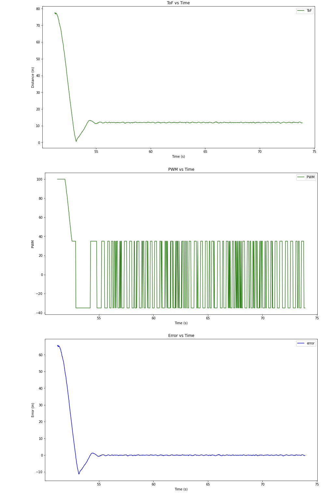
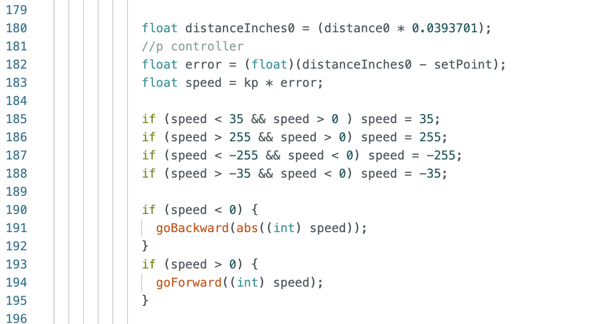
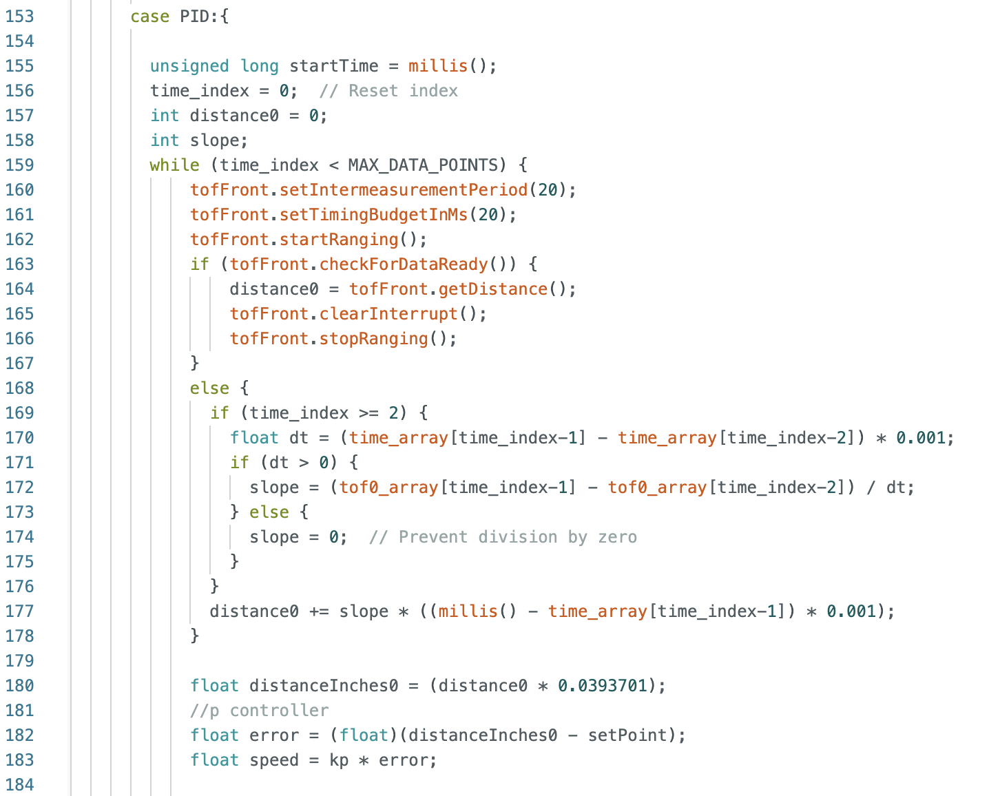
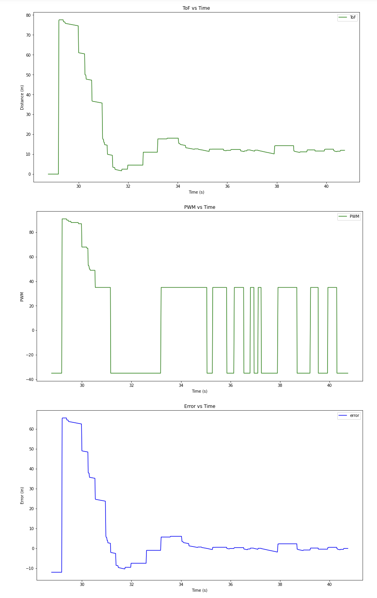

# Lab 5 (Linear PID control and Linear interpolation)

## Prelab

I chose to approach debugging in this lab the same way I approached it in previous labs. First I collected all of the data and then I did a bulk transfer to my computer at the end. I collect data while the car is moving, and then I stop the car and send the data to my laptop. This code is the same as in the previous labs. 

On the python side, I start my notification handler and print the data being received. I also graph it immediately after collection so I have a visual representation. 

## Lab Tasks

### P/I/D discussion

I started this lab with a basic P controller, intending to build more complexity from there. The P controller worked, though I did encounter more than a few problems and ultimately did not end up implementing PI, PD, or PID. For Kp values, I started small and worked my way up until the car was moving quickly but not hitting the wall. I ended up dealing with quite a bit of overshoot as well as a lot of oscillations around the 1ft marker. I was calculating my distances and error in inches, so my Kp value ended up being larger than I expected (> than 1). I saw best performance at 1.4. My car overshot the 1ft mark but corrected before hitting the wall, and it moved fairly quickly the whole time. If Kp was any lower, the car accelerated very slowly, and if it was any higher the car hit the wall.

Here are some videos of the car at different Kp values and the graphs of the corresponding data:

Note that I got my code to work on my car, but as I began taking videos and recording graphs for this lab report, my motor drivers annihilated themselves. I'm not entirely sure what happened but my current theory is that because I had them hanging loose next to each other in the car, the Vin pin on one driver shorted with the GND pin on the other driver. Oops. More testing is needed to confirm that they are truly and completely dead but I'm 98.5% sure that they are and that I need new motor drivers (sorry about that). As this happened around 10pm on Tuesday night, the videos shown are of my code running on Selena Yao's car (thank you Selena). 

Kp = 0.2:

<iframe width="560" height="315" src="https://www.youtube.com/embed/vA7aVGoPfVA" frameborder="0" allowfullscreen></iframe>

Kp = 1.4:

<iframe width="560" height="315" src="https://www.youtube.com/embed/GS5flJMKNHQ" frameborder="0" allowfullscreen></iframe>

Kp = 2:

<iframe width="560" height="315" src="https://www.youtube.com/embed/1HcoIkLjdjE" frameborder="0" allowfullscreen></iframe>

And just to prove I did indeed get code working on my car for a short while, here is a video of my car running one of the intermediate Kp values I tested while tuning. 

<iframe width="560" height="315" src="https://www.youtube.com/embed/0BFt5zU2nEI" frameborder="0" allowfullscreen></iframe>

As you may have noticed in the above videos and graphs, my car oscillates a lot around the 1ft mark. This is because I bounded the pwm values between +/- 35 and +/- 255. I started testing with an upper bound of 100 but raised it to 255 later. I also experimented with the lower bound and tried 35, 45, and 50 to see if there was a significant difference in result (there wasn't). As error approaches 0, the motor inputs oscillate between pwm values of +35 and -35. This is because I mapped any pwm values less than +35 to 35 and any negative pwm values greater than -35 to -35. I tried several things to fix this problem, but all of my proposed fixes caused additional problems. Solving this oscillation issue will require more time and attention in the future. The first thing I tried was adding an integrator and doing PI control. I found that anything other than a very very small value of Ki (about 0.0015) caused my car to slam into the wall. And a Ki value that small did not have a large effect on the system. There are several solutions to integral windup, but I decided to abandoned PI and take a different approach for now. My next attempt was to continuously check the error values and if the car was with 5% of the target distance to call a stop function which set all of the motor inputs to 0. This had the unintended side effect of preventing my car from driving backwards to correct overshoot. I'm not sure why yet, this also needs more investigation. For now, I'm just dealing with the oscillations. 

### Range/Sampling time discussion

I kept the sensor in short distance mode in the hope of higher precision, but I don't think range has too much of an impact in this lab. The behavior of the car is mostly the same if it's 2m away or 3m away. 

My sampling time (before extrapolation) is about 40Hz (800 data points in 20 seconds). This is the same rate as my control loop. 

### Linear Extrapolation

Linear extrapolation is useful because the ToF sensors have a very slow sampling time. In fact, after implementing linear extrapolation my control loop was 4 times faster than the sampling rate of the ToF sensors. To be honest, despite the fact that I'm now "getting" more data and running the PID control loop more often, I found my implemented controller to be generally worse with extrapolation than without. This is because my car was quite jumpy and the oscillations I discussed earlier were definitely worse. In the future I'll want to filter this data because extrapolation just amplified the noise already in the system. Once I implement a filter, linear extrapolation will definitely become an extremely useful tool. 

Here is a video and some graphs from my P controller with linear extrapolation implemented: 

<iframe width="560" height="315" src="https://www.youtube.com/embed/_W9Dih6R8fQ" frameborder="0" allowfullscreen></iframe>

### Conclusion: 

I definitely learned a lot from this lab - about PID in general but also the importance of good, quick data. More than that, however, I dsicovered that despite the fact that I re-did a lot of my work from lab 4 to make my car as robust as possible before driving it at walls, I did not account for all the possibilities, and things break at the worst possible times. Next time I shall not put free floating electronics next to each other with exposed pins, and I will probably also start the lab sooner so I don't have to deal with these problems the night before it's due.
