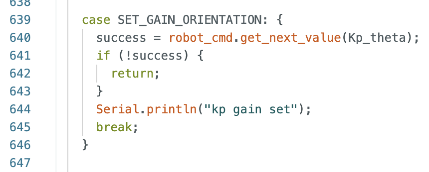
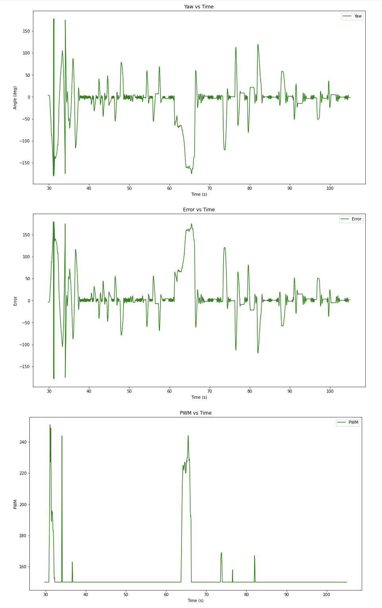
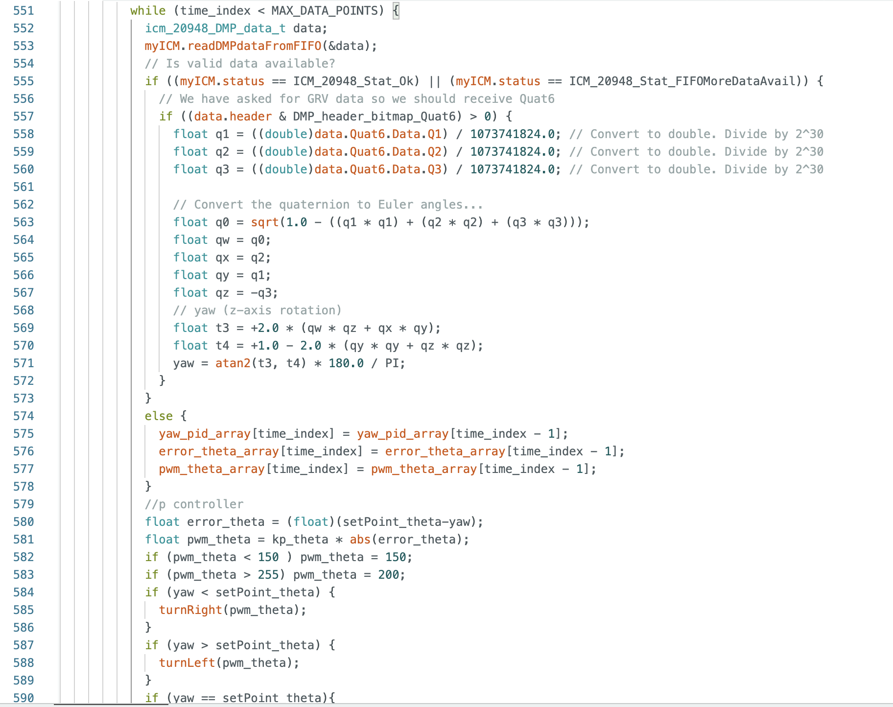
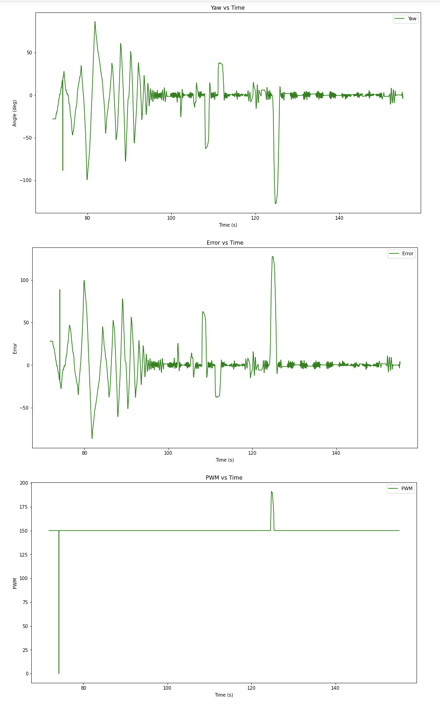

# Lab 6 (Orientation Control)

## Prelab

I handled receiving data the same way I have been on all previous labs - filling arrays on the Artemis and then sending them over once all data has been collected. 

However, for this lab I implemented a new (short) case statement so that I could send different gain values while the robot is running. This helped streamline the tuning process. Here is what the case statement looked like: 

In addition to adding this case statment, I also set up DMP using the example code from the ICM-20948 library and the class webpage on DMP. I decided that setting up DMP was worth my time because getting good controls is impossible without good data. I verified DMP data by printing roll, pitch, yaw, and watching the Serial Monitor while rotating my car. Here is some footage of me doing that: 

<iframe width="560" height="315" src="https://www.youtube.com/embed/LoXVA7Fj6No" frameborder="0" allowfullscreen></iframe>

## Lab Tasks

### PID Discussion

With time constraints I ended up only setting up a P controller. However, honestly the P controller worked well enough. There was quite a bit of oscilliting when it first started up but once the car was running for a few seconds even when I kicked it very far it turned right back to the correct angle with very little oscillating. I found a good Kp value to be 1.4. This minimized oscillations close to the setpoint while still accelerating the car quickly to the setpoint when it's far away. The actual implementaiton of the p controller was pretty much a copy and paste from lab 5 with a few variable name changes. 

Here's a video of me working out some frustrations on my car: 

<iframe width="560" height="315" src="https://www.youtube.com/embed/1RfNHJpMqkY" frameborder="0" allowfullscreen></iframe>

And here are the corresponding graphs:

As you can see, There are large initial oscilations before it settles around the set point (0 degrees). I kicked the car several times over many seconds. Note that each spike is a kick and that while the next spike shows some overshoot there are minimal oscilaltions happening around the setpoint. Also note that in the middle of the graph there's some weirdness happening but that was when I kicked my car a little too hard and it moved linearly a significant distance while also turning. 

### Range/Sampling Time Discussion

I found that my sampling time was longer than I expected it to be. In comparison to the ToF sensors the IMU sensor samples very quickly. Initial testing told me that the IMU samples at a rate of approximately 70 Hz. This was found by taking the number of data points (collected only when data was ready) and dividing it by the time it took to collect them. This is significantly faster than the 40 Hz sampling rate of the ToF sensors in lab 5. 

### Process

I spent a significant portion of my time on this lab messing with DMP and trying to get the best data possible. I did this by taking the example code relating to Euler's Angles and integrating it into my code. This took me a little while to accomplish and test. I also had to retune my car a little bit to find my deadband while turning (a much higher value then it is driving straight). I ended up setting my deadband to a PWM value of 150. After that the code was mostly copy and paste from lab 5. The data was significantly nicer and less noisy than it was in lab 5, which made tuning my P controller a lot easier. Here is what some relevant parts of my code looked like: 

Additionally, here are videos and graphs from the tuning process: 

<iframe width="560" height="315" src="https://www.youtube.com/embed/ZYKgDPz8xso" frameborder="0" allowfullscreen></iframe>

