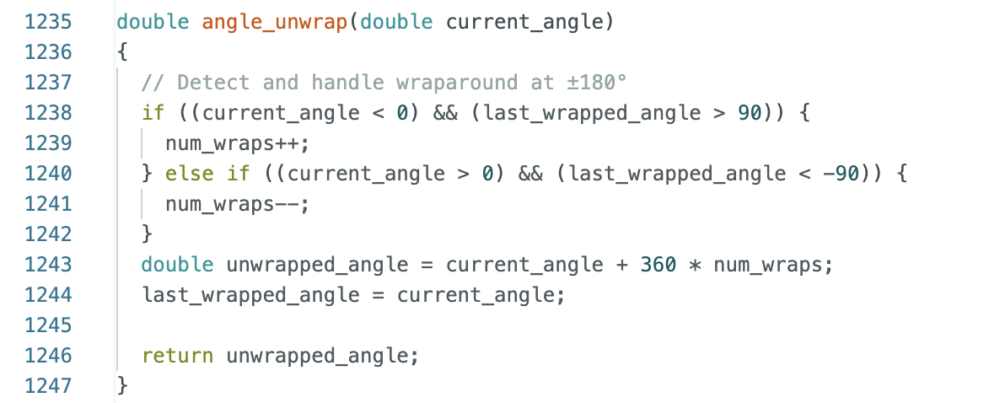
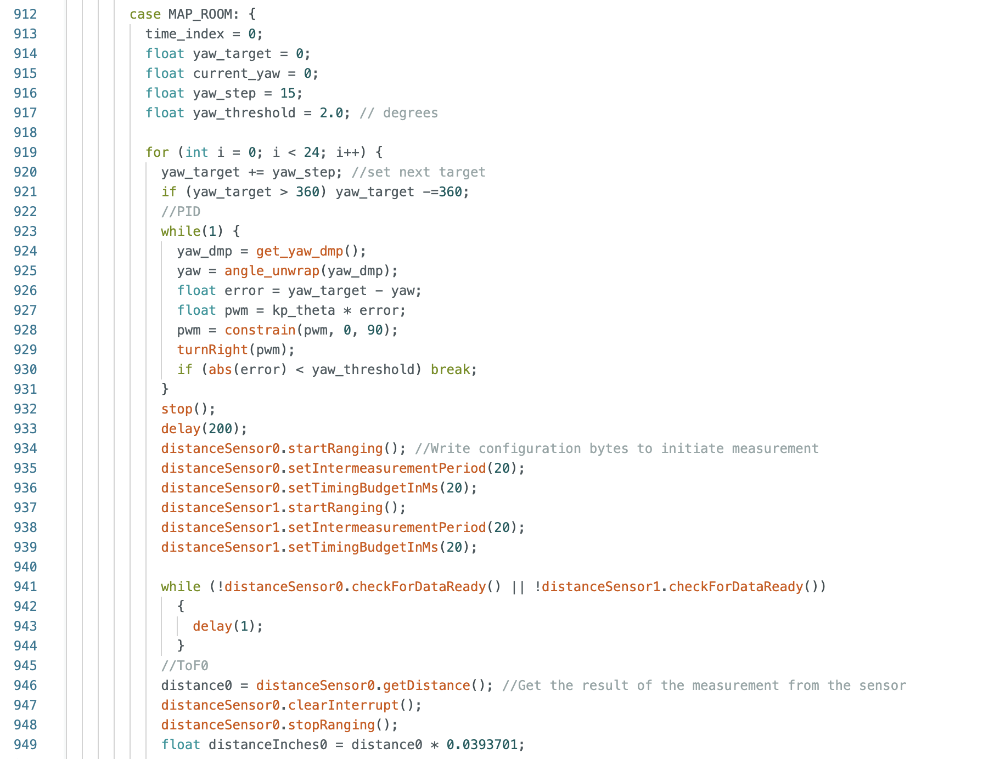
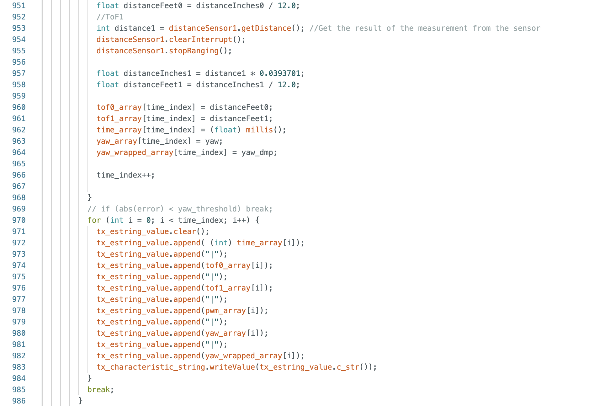
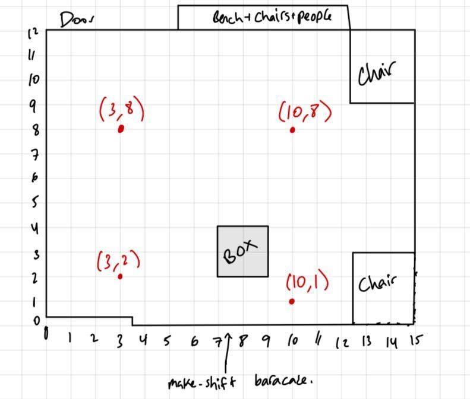
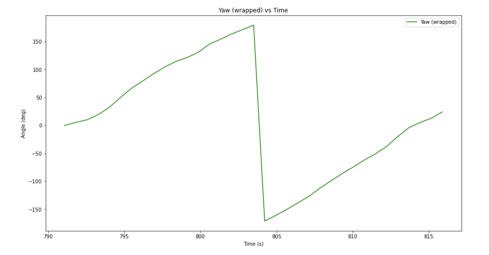
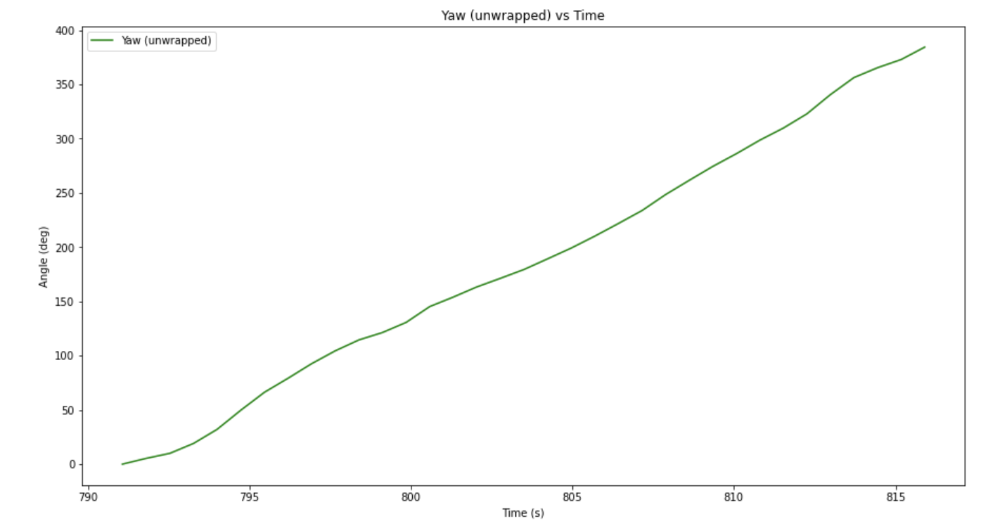
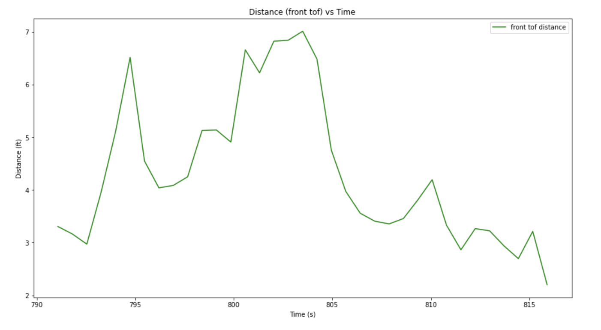
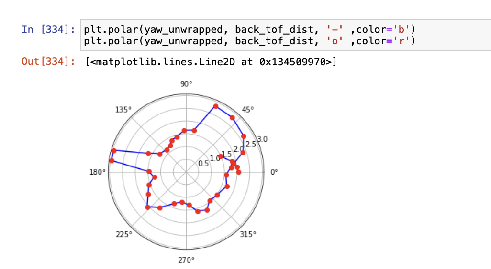
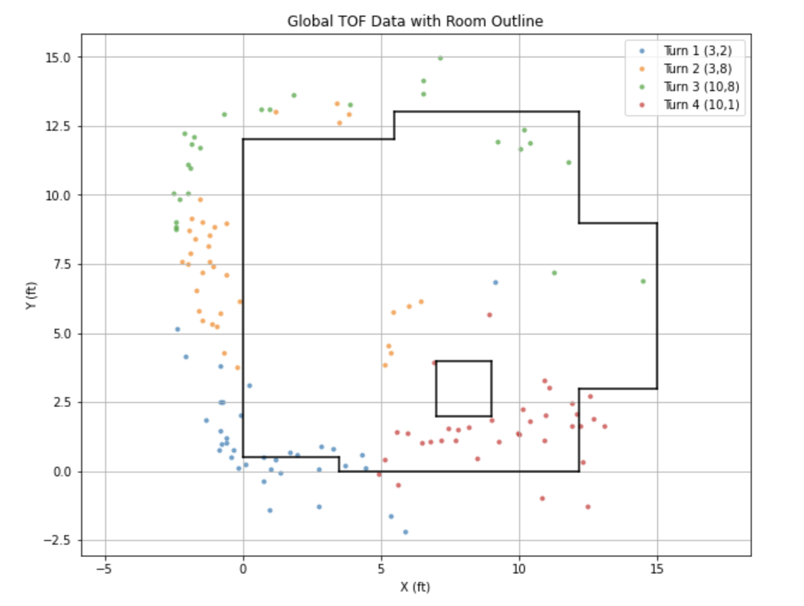

# Lab 9 (Mapping)

## Control

For this lab I used my DMP code from lab 6 to get accurate and low-noise orientation data. I also used my PID code from lab 6 (with some retuning necessary) to move my robot to a series of setpoints (every 10 degrees). This was challenging for several reasons. First, DMP only gives angles between -180 to 180. This could lead to problems with PID where the car overshoots when it's not supposed to. 

I had a very hard time implementing a fix for this, but I saw Aidan McNay's post on Ed Discussion and based my solution off of his (thanks Aidan).

Here is a video of my car spinning in a circle. As you can see, the car moves in increments of 15 degrees, stopping to collect ToF data in-between. 

******INSERT VIDEO******

Here is some of the code: 

## Mapping and Data Collection

Next was to collect some data! Unfortunately, it took me so long to get PID working that I did not get to test my robot in the lab set up. However! I did create my own lab set up with Tyler, Kelvin, and Selena in a hallway in Phillips. Here are some photos: 

Here is a diagram with points to place the car mapped out with coordinates

Then I ran my car a bunch of times. I found that my car tended to drift a lot (the left side consistently starts spinning before the right side). I didn't spend much time trying to actually fix this issue, and instead decided to just collect the data and figure out what to do with it/try to clean it up in post processing.

## Post Processing

I sent over the data via BLE just as I have in the 8 labs before this one. I parsed the data and graphed a few things I thought would be useful. Here they are: 

This data is pretty useless as it is, so I did a bunch of stuff to it in order to make it useable. First I mapped out my angles to 0-360 because I didn't start at the same angle at each point. This made my yaw data uniform throughout all the measurments. I did this by simply looking at the first angle I collected and offsetting ther rest of the data by that amount. I also converted my data from degrees to radians and polar plotted it so I could see if it looked like reasonable data. 

Here is an example: 

Once I had collected my data and confirmed that it was probably valid, I needed some way to convert the data I collected into (x,y) coordinate points on the global map I am trying to make of my obstacle course/room/random part of phillips hallway. I did this using the sin and cos of the yaw data. I computed the translation of the current angle and stored it as a tuple in an array. At each of the 4 points, once I had collected data and processed it a bit, I just appended the data set to this global data set of (x,y) points. I then used that data set to reconstruct the room (as shown below).

As you can see, this was mildly successful. I've got the general shape of the room and obstacles but there's a lot of noise and random data points that are outside the bounds of the room, as well as not enough data points on one side of the room. I bet I can do something about this by dealing with my car drifting as it turns, as well as filtering in post. I will have to think about this more, but for now I'm out of time for this lab.
